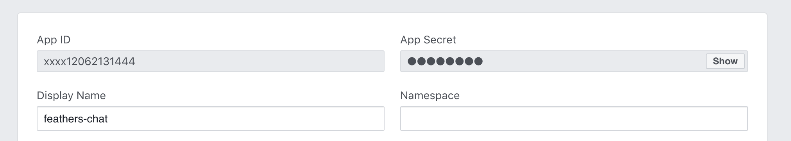

# Facebook

## Application client and secret

The client id (App ID) and secret can be found in the Settings of the [Facebook app](https://developers.facebook.com/apps):



## More profile data

The standard oAuth strategy only returns the default profile fields (`id` and `name`). To get other fields, like the email or profile picture, the [getProfile](../../api/authentication/oauth.md#getprofile-data-params) method of the [oAuth strategy needs to be customized](../../api/authentication/oauth.md#customization) to call the Graph API profile endpoint `https://graph.facebook.com/me` with the additional fields that are required  with an HTTP request library like [Axios](https://developers.facebook.com/tools/explorer/).

> __Pro tip:__ Facebook API requests can be tested via the [Graph API explorer](https://developers.facebook.com/tools/explorer/).

The following example allows to log in with Facebook in the [chat application from the guide](../../guides):

:::: tabs :options="{ useUrlFragment: false }"
::: tab "JavaScript"
In `src/authentication.js`:

```js
const axios = require('axios');
const { OAuthStrategy } = require('@feathersjs/authentication-oauth');

class FacebookOAuth extends OAuthStrategy {
  async getProfile (authResult) {
    // This is the oAuth access token that can be used
    // for Facebook API requests as the Bearer token
    const accessToken = authResult.access_token;

    const { data } = await axios.get('https://graph.facebook.com/me', {
      headers: {
        authorization: `Bearer ${accessToken}`
      },
      params: {
        // There are 
        fields: 'id,name,email'
      }
    });

    return data;
  }

  async getEntityData(profile) {
    // `profile` is the data returned
    const baseData = await super.getEntityData(profile);

    return {
      ...baseData,
      email: profile.email
    };
  }
}

module.exports = app => {
  // ...
  authService.register('facebook', new FacebookOAuth());
  // ...
};
```
:::
::: tab "TypeScript"
```ts

```
:::
::::

