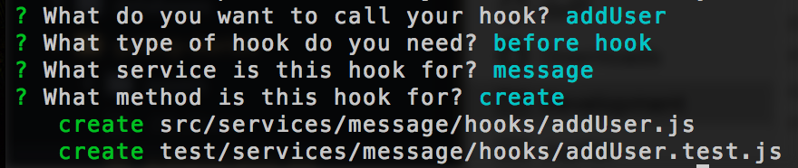
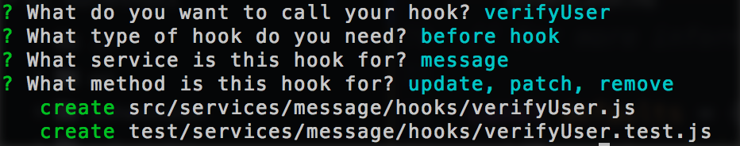

# User authentication

In [the previous chapter](first-app.md) we set up a REST and real-time API at the `/messages` endpoint. Our generated app also comes with a `/users` endpoint and local authentication. In this chapter we will add user specific restrictions to posting and editing messages.

## Creating and authenticating users

A new user for local authentication can be created by POSTing to the `/users` endpoint. The fields required are `email` for the username and `password` for the password. Passwords will be automatically hashed when creating a new user using [bcrypt](https://www.npmjs.com/package/bcryptjs). The following CURL request creates a `hello@feathersjs.com` user with `testing` as the password:

```
$ curl 'http://localhost:3030/users/' -H 'Content-Type: application/json' --data-binary '{ "email": "hello@feathersjs.com", "password": "testing" }'
```

Feathers Authentication uses [JSON webtoken (JWT)](https://jwt.io/). To obtain a token for the user we created we need to POST the login information to the `http://localhost:3030/auth/local` endpoint set up by Feathers authentication. The returned token then needs to be set in the `Authorization` header for requests that require authentication. When we create a frontend for our chat API this will be done transparently for you by the [Feathers client](../clients/feathers.md).

## Authorization

Now that we have a user that we can use to authenticate we want to restrict the messages service only to authenticated users and also have the user information available. We could have done that already in the service generator by answering yes when asked if we need authentication but we can also easily add it manually by changing `src/services/message/hooks/index.js` to:

```js
'use strict';

const globalHooks = require('../../../hooks');
const auth = require('feathers-authentication').hooks;

exports.before = {
  all: [
    auth.verifyToken(),
    auth.populateUser(),
    auth.requireAuth()
  ],
  find: [],
  get: [],
  create: [],
  update: [],
  patch: [],
  remove: []
};

exports.after = {
  all: [],
  find: [],
  get: [],
  create: [],
  update: [],
  patch: [],
  remove: []
};
```

## Message creation

We also want to always add the user information (`user._id`) to newly created messages. This can be done by creating our own `before` hook. Hooks are a powerful way to register composable middleware before and after a service method runs. You can learn more about it in the [hooks chapter](../hooks/readme.md). To generate a new hook run:

```
$ yo feathers:hook
```

It will be a `before` hook called `addUser` for the `message` service on the `create` method:



In that hook we can now modify the data before sending them to the database and add the authenticated user id. Change the hook file at `src/services/message/hook/addUser.js` to:

```js
'use strict';

// src/services/message/hooks/addUser.js.js
// 
// Use this hook to manipulate incoming or outgoing data.
// For more information on hooks see: http://docs.feathersjs.com/hooks/readme.html

module.exports = function(options) {
  return function(hook) {
    // Set the data to the user id
    hook.data.user_id = hook.params.user._id;
  };
};
```

Now we created a flexible, configurable hook that always adds the authenticated user id to the database.

## Message authorization

Finally, we need one more hook that makes sure that users can only `remove`, `update` and `patch` their own message (see [the services chapter](../services/readme.md) for more information about those methods).

Let's create a `verifyUser` *before* hook for the `message` service that runs before those methods:



And change it at `src/services/message/hook/verifyUser.js` to:

```js
'use strict';

// src/services/message/hooks/verifyUser.js.js
// 
// Use this hook to manipulate incoming or outgoing data.
// For more information on hooks see: http://docs.feathersjs.com/hooks/readme.html

const errors = require('feathers-errors');

module.exports = function(options) {
  return function(hook) {
    const params = hook.params; // service params
    const messageService = hook.app.service('messages');
    
    // First get the message that the user wants to access
    return messageService.get(hook.id).then(message => {
      // Throw a not authenticated error if the message and user id don't match
      if(message.user_id !== params.user._id) {
        throw new errors.NotAuthenticated('Access not allowed');
      }
      
      // Otherwise just return the hook
      return hook;
    });
  };
};
```

That's it (for now)! We created a database backed REST and Socket.io real-time chat API with local user authentication and authorization. We used [services](../services/readme.md) and [hooks](../hooks/readme.md) which is almost everything there is to Feathers.

In the next chapter we will briefly talk about [building a frontend for our API](frontend.md) before learning more about [services](../services/readme.md) and diving into the [guides](../guides/readme.md).
