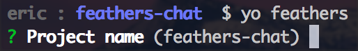
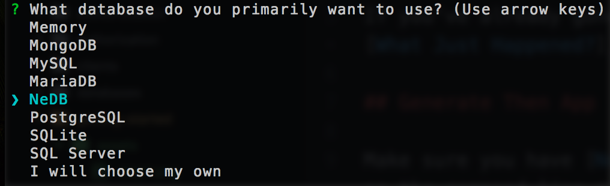
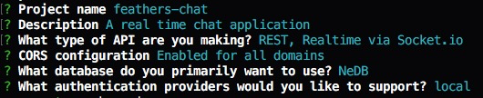
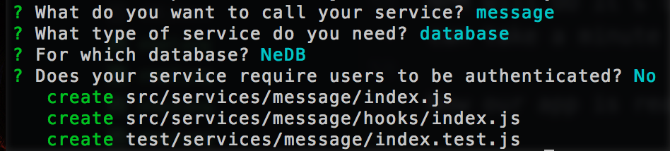
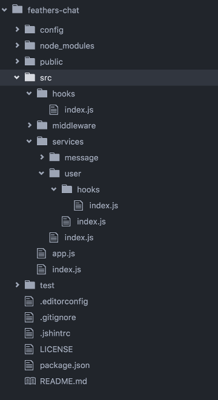

# Creating A Feathers app

Well alright! Let's build our first Feathers app! We're going to build a real-time chat app with MongoDB as the database. It's a great way to cover all the things that you'd need to do in a real world application and how Feathers can help. It also makes a lot more sense to have a real-time component than a Todo list. 😉

If you've already gone through the [Quick Start](quick-start.md) section you can skip ahead to [What Just Happened?](#what-just-happened).

## Generate Then App

Make sure you have [NodeJS](https://nodejs.org) and [NPM](http://npmjs.org) installed and available on the command line as `node` and `npm`. Then we can install the Yeoman and the Feathers generator.

```
$ npm install -g yo generator-feathers
```

Create a directory for our new app:

```
$ mkdir feathers-chat
$ cd feathers-chat/
```

Generate your app and follow the prompts.

```
$ yo feathers
```

When presented with the project name just hit enter.



Enter in a short description of your app.


You can now choose which providers you want to support. Since we're setting up a real-time REST API we'll go with the default REST and Socket.io. So just hit enter.

You can learn more about Feathers providers in [Providers chapter](../../real-time/readme.md).


Next we'll be prompted to support [CORs](https://developer.mozilla.org/en-US/docs/Web/HTTP/Access_control_CORS). This basically allows your client to connect to the server from wherever. You can whitelist specific domains but again, just hit enter for now.


Now let's choose our database. You can see that Feathers supports a bunch through the generator and even more outside the generator. Let's use the default [NeDB](https://github.com/louischatriot/nedb). NeDB is a local file-system based database so we don't have to start a separate database server. You can find out more about our database adapters in the [Databases chapter](../../databases/readme.md).



Since pretty much every app needs authentication of some sort we generate almost everything you need to get going. You can learn more about authentication in Feathers by reading the [Authentication chapter](../../authentication/readme.md). In our case we will use the default of local authentication:


Your options should all look like this and you should have seen that a whole bunch of files were created.



NPM will do it's thing and install all our dependencies. Depending on your Internet connection this can take a minute or two.

Now our app is ready to go but let's first create the `/messages` service:

```
$ yo feathers:service
```

The name should be `message` and the other options can be accepted with their default (we will add authorization in the [next chapter](authentciation.md)):



Now we can now start our app with:

```
$ npm start
```

Open up [localhost:3030](http://localhost:3030) in your browser and you will see it running. The message endpoint will be available at [localhost:3030/messages](http://localhost:3030/messages), the authentication endpoint at [localhost:3030/users](http://localhost:3030/users) (which will show an unauthorized error).

## What Just Happened

A lot of stuff just happened there very quickly. We automatically generated a basic application with a REST and real time API for both [messages](http://localhost:3030/messages) and [users](http://localhost:3030/users). We now have full CRUD capability that uses a persistent datastore for both the `/messages` and `/users` endpoints.

The application got initialized with the following folder structure:



Let's quickly look at each folder:

- `config` contains a `default.json` and `production.json` application configuration file for things like the database connection strings and other configuration options.
- `public` is the publicly hosted folder with the homepage
- `src` contains all the application source files
  - `hooks` will contain global [hooks](../hooks/readme.md)
  - `middleware` contains [Express middleware](../middleware/readme.md)
  - `services` has a folder for each service. A service has an `index.js` and a `hooks` folder for service specific hooks
  - `app.js` is the main application file which can be imported to test services
  - `index.js` imports `app.js` and starts the server on the ports set in the configuration file
- `test` contains test files for the app, services and hooks

## Using the API

With the server running we have a full CRUD API available at the `/messages` endpoint. [http://localhost:3030/messages](http://localhost:3030/messages) endpoint. It can be used by sending a POST request with any REST client like [Postman](https://chrome.google.com/webstore/detail/postman/fhbjgbiflinjbdggehcddcbncdddomop?hl=en) or via CURL like this:

```
$ curl 'http://localhost:3030/messages/' -H 'Content-Type: application/json' --data-binary '{ "text": "Hello Feathers!" }'
```

You can also connect to the real-time API via [Socket.io](http://socket.io/). Add the following to `public/index.html` before the closing `<body>` tag:

```html
<script src="socket.io/socket.io.js"></script>
<script type="text/javascript">
  var socket = io();
  
  socket.on('messages created', function(message) {
    console.log('Someone created a message', message);
  });
  
  socket.emit('messages::create', { text: 'Hello from websocket!' });
</script>
```

Open the console and [localhost:3030](http://localhost:3030) and you will see the new message. Those events also work for REST calls, for example, with the page open, running

```
$ curl 'http://localhost:3030/messages/' -H 'Content-Type: application/json' --data-binary '{ "text": "Hello again!" }'
```

Will also log the new message on the console in the browser. This is basically how Feathers does real-time and you can learn more about it in the [Real-Time chapter](../real-time/readme.md).

## What's next?

We already have a fully usable CRUD API for chat messages and local authentication set up. In the [next chapter](authentication.md) we will create a new user and restrict access to our messages service.
