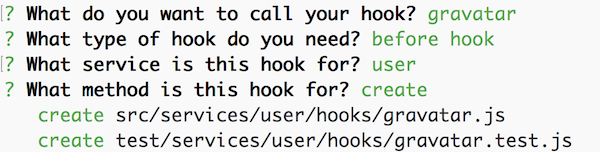
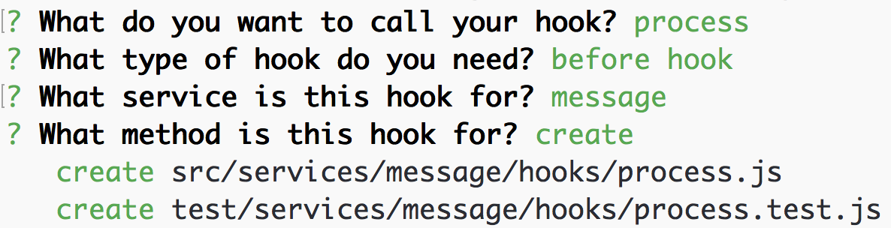
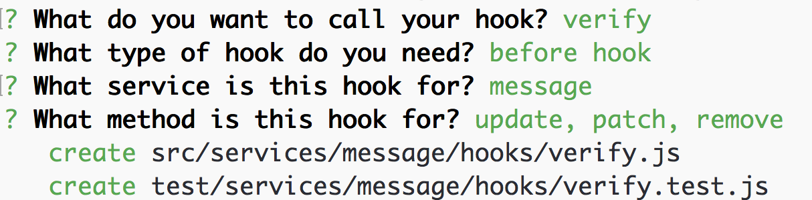

# Using Hooks and Manipulating Data

In the [previous section](user-management.md) we set up authentication, a signup and login page, and restricted the message service to only authenticated users. Now we can add additional information, like the user who sent it and the creation time to a new message.

## Adding information with hooks

Adding information like the current user and the creation time can be done by creating our own `before` hook. Hooks are a powerful way to register composable middleware before and after a service method runs. You can learn more about it in the [hooks chapter](../hooks/readme.md). To generate a new hook run:

```
$ yo feathers:hook
```

### Gravatar profile images

Our first hook will be a `before` hook for the `create` method on the `user` service called `gravatar`:



In this hook we will modify the data before sending it to the database and add the [Gravatar](http://en.gravatar.com/) image from a users email address when someone signs up. Change `src/services/user/hooks/gravatar.js` to:

```js
'use strict';

// src/services/user/hooks/gravatar.js
//
// Use this hook to manipulate incoming or outgoing data.
// For more information on hooks see: http://docs.feathersjs.com/hooks/readme.html

// We need this to create the MD5 hash
const crypto = require('crypto');

// The Gravatar image service
const gravatarUrl = 'https://s.gravatar.com/avatar';
// The size query. Our chat needs 60px images
const query = `s=60`;

// Returns a full URL to a Gravatar image for a given email address
const gravatarImage = email => {
  // Gravatar uses MD5 hashes from an email address to get the image
  const hash = crypto.createHash('md5').update(email).digest('hex');

  return `${gravatarUrl}/${hash}?${query}`;
};

module.exports = function() {
  return function(hook) {
    // Assign the new data with the Gravatar image
    hook.data = Object.assign({}, hook.data, {
      image: gravatarImage(hook.data.email)
    });
  };
};
```

### Processing messages

The next hook will also be a `before` hook for a `create` method but this time for the `message` service.  We'll do two things:

1. Add the `_id` of the user that created the message as `userId`
2. Add a `createdAt` timestamp with the current time

Let's generate that hook!



Now we can update `src/services/message/hooks/process.js` to:

```js
'use strict';

// src/services/message/hooks/process.js
// 
// Use this hook to manipulate incoming or outgoing data.
// For more information on hooks see: http://docs.feathersjs.com/hooks/readme.html

module.exports = function(options) {
  return function(hook) {
    // The authenticated user
    const user = hook.params.user;
    // The actual message text
    const text = hook.data.text
      // Messages can't be longer than 400 characters
      .substring(0, 400)
      // Do some basic HTML escaping
      .replace(/&/g,'&amp;').replace(/</g,'&lt;').replace(/>/g,'&gt;');

    // Override the original data
    hook.data = {
      text,
      // Set the user id
      userId: user._id,
      // Add the current time via `getTime`
      createdAt: new Date().getTime()
    };
  };
};
```

### Serializing Messages

So far we've implemented a couple `before` hooks but we can also format our data using `after` hooks, which get called after a service method returns.

Let's say that we want to populate the sender of each message so that we can display them in our UI. Instead of creating one of your own hooks, this time we'll use one of the ones that comes [bundled with Feathers](../hooks/bundled.md). In this case we'll use the `populate`and `remove` hook that comes bundled with `feathers-hooks`.

We need to make a small change to our `src/services/message/hooks/index.js` file so that it now looks like this:

```js
'use strict';

const auth = require('feathers-authentication').hooks;
// Include the feathers-hooks bundled hooks
const hooks = require('feathers-hooks').hooks;

const restrictToSender = require('./restrict-to-sender');
const process = require('./process');
const globalHooks = require('../../../hooks');
// Use the userId field in a message to get the user from
// the users service and then add it as sentBy to the message.
const populateSender = hooks.populate('sentBy', {
  service: 'users',
  field: 'userId'
});

exports.before = {
  all: [
    auth.verifyToken(),
    auth.populateUser(),
    auth.requireAuth()
  ],
  find: [],
  get: [],
  create: [process()],
  // Remove the sentBy field
  update: [hooks.remove('sentBy'), restrictToSender()],
  patch: [hooks.remove('sentBy'), restrictToSender()],
  remove: [restrictToSender()]
};

exports.after = {
  all: [],
  find: [populateSender],
  get: [populateSender],
  create: [populateSender],
  update: [],
  patch: [],
  remove: []
};
```

This will take the ID stored at the `sentBy` attribute on our Message, query the `users` service to find a User with that ID, and set the User object on the `sentBy` attribute (replacing the ID).

As you can see, manipulating data is pretty easy with hooks. To improve portability, we could break our hooks up into multiple smaller hooks and chain them. A good candidate might be to move manipulating the `createdAt` attribute into it's own hook so that it can be shared across multiple services.


## Message authorization

We've seen how Hooks can be used to manipulate data but they can also be used for permissions and validations. We need one last hook that makes sure that users can only `remove`, `update` and `patch` their own message (see [the services chapter](../services/readme.md) for more information about those methods). 

Let's create a `restrict-to-sender` _before_ hook for the `message` service that runs before those methods:



Now change the file at `src/services/message/hook/restrict-to-sender.js` to:

```js
'use strict';

// src/services/message/hooks/restrict-to-sender.js
//
// Use this hook to manipulate incoming or outgoing data.
// For more information on hooks see: http://docs.feathersjs.com/hooks/readme.html

const errors = require('feathers-errors');

module.exports = function(options) {
  return function(hook) {
    const messageService = hook.app.service('messages');

    // First get the message that the user wants to access
    return messageService.get(hook.id, hook.params).then(message => {
      // Throw a not authenticated error if the message and user id don't match
      if (message.sentBy._id !== hook.params.user._id) {
        throw new errors.NotAuthenticated('Access not allowed');
      }

      // Otherwise just return the hook
      return hook;
    });
  };
};
```

That's it! We now have a fully functional real-time chat API complete with user signup, local authentication, and authorization. You've now had an introduction to [services](../services/readme.md), [hooks](../hooks/readme.md) and [middleware](../middleware/readme.md), which is almost everything there is to Feathers.

In the next chapter we will briefly talk about [building a frontend](frontend.md) for our Chat app before learning more about Feathers and diving into the [guides](../guides/readme.md).
