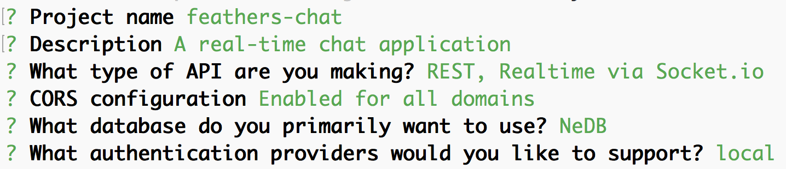
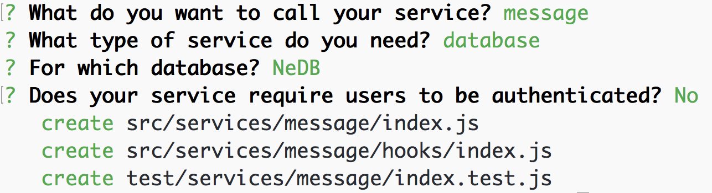

# Scaffolding and Services

In this part we're going to scaffold a Feathers app, create our first service, send some data to the service and see it in real time! If you've already gone through the [Quick Start](quick-start.md) section you can skip ahead to [What Just Happened?](#what-just-happened).

## Generate The App

Make sure you have [NodeJS](https://nodejs.org) and [npm](http://npmjs.org) installed and available on the command line as `node` and `npm`. Then we can install the Feathers CLI.

```
$ npm install -g feathers-cli
```

Create a directory for our new app:

```
$ mkdir feathers-chat
$ cd feathers-chat/
```

Generate your app and follow the prompts.

```
$ feathers generate
```

When presented with the project name just hit enter, or enter a name (no spaces).

Next, enter in a short description of your app.

You're now presented with the option to choose which providers you want to support. Since we're setting up a real-time REST API we'll go with the default REST and Socket.io options. So just hit enter. You can learn more about Feathers providers in the [Providers chapter](../real-time/readme.md).

Next we'll be prompted to support [CORS](https://developer.mozilla.org/en-US/docs/Web/HTTP/Access_control_CORS). This basically allows your client to connect to the server from wherever. You can whitelist specific domains but again, just hit enter for now.

Now let's choose our database. You can see that Feathers supports a bunch through the generator and [even more outside the generator](../databases/readme.md). Let's use the default NeDB. NeDB is a local file-system based database so we don't have to start a separate database server. You can find out more about our database adapters in the [Databases chapter](../databases/readme.md).

Since pretty much every app needs authentication we generate almost everything you need to get going. You can learn more about authentication in Feathers by reading the [Authentication chapter](../authentication/readme.md). In our case we will just use the default local authentication.

Your options should all look like this and you should have seen that a whole bunch of files were created.



Next, npm will do its thing and install all our dependencies. This can take a minute or two based on your Internet connection speed.

Now our app is ready to go but let's add a Message service for our chat app. Because we're in the feathers-cli scope, we don't need to preceed the command with `feathers` this time:

```
$ generate service
```

The name should be `message` and the other options can be accepted with their default value (we will add authorization in the next chapter):



Exit the feathers-cli:

```
$ exit
```

We can now start our app, with:

```
$ npm start
```

Open up [localhost:3030](http://localhost:3030) in your browser and you will see your new feathers app running. The endpoint for the Message service you just created is [localhost:3030/messages](http://localhost:3030/messages).

**ProTip:** If you notice any errors when running `npm start`, make sure you have the latest versions of Node and NPM, otherwise you might run into issues such as [this](https://github.com/feathersjs/generator-feathers/issues/78).

## What Just Happened

A lot of stuff just happened there very quickly. We automatically generated a basic application with a REST and real time API for both [messages](http://localhost:3030/messages), [users](http://localhost:3030/users) and local authentication. We now have full CRUD capability that uses a persistent datastore for both the `/messages` and `/users` endpoints. We also have local authentication fully configured and some basic authorization permissions on the user service.

If you look at your source code you'll see that the following folder structure was generated:

- `config` contains a `default.json` and `production.json` application configuration file for things like the database connection strings and other configuration options.
- `public` is the publicly hosted folder with the homepage
- `src` contains all the application source files
  - `hooks` will contain global [hooks](../hooks/readme.md)
  - `middleware` contains [Express middleware](../middleware/readme.md)
  - `services` has a folder for each service. A service has an `index.js` and a `hooks` folder for service specific hooks
  - `app.js` is the main application file which can be imported to test services
  - `index.js` imports `app.js` and starts the server on the ports set in the configuration file
- `test` contains test files for the app, services and hooks

## Creating Our First Message

With the server running let's create our first message by sending a POST request to our message service at [http://localhost:3030/messages](http://localhost:3030/messages). You can use any REST client like [Postman](https://chrome.google.com/webstore/detail/postman/fhbjgbiflinjbdggehcddcbncdddomop?hl=en) or via CURL like this:

```
$ curl 'http://localhost:3030/messages/' -H 'Content-Type: application/json' --data-binary '{ "text": "Hello Feathers!" }'
```

> **ProTip:** If you are making requests from a browser or Postman you want to make sure you set the `Accept` header to `application/json` otherwise you will get HTML errors back. For more information see the [Error Handling section](../middleware/error-handling.md).

You can also connect to the real-time API using [Socket.io](../real-time/socket-io.md). The easiest way to do so is using the [Feathers client](../clients/feathers.md). You can learn more about using Feathers on the client in the [Client chapter](../clients/readme.md).

Add the following to `public/index.html` before the `</body>` tag:

```html
<script type="text/javascript" src="//cdnjs.cloudflare.com/ajax/libs/core-js/2.1.4/core.min.js"></script>
<script src="//unpkg.com/feathers-client@^1.0.0/dist/feathers.js"></script>
<script src="socket.io/socket.io.js"></script>
<script type="text/javascript">
  // Establish a Socket.io connection to the local server
  var socket = io();
  // Create a client side Feathers application that uses the socket
  // for connecting to services
  var app = feathers();
  app.configure(feathers.socketio(socket));
  // Retrieve a connection to the /messages service on the server
  // This service will use websockets for all communication
  var messages = app.service('messages');

  // Listen for when a new message has been created
  messages.on('created', function(message) {
    console.log('Someone created a message', message);
  });

  // Create a new message on the service
  messages.create({ text: 'Hello from websocket!' });
</script>
```

Open the console, then go to [localhost:3030](http://localhost:3030) and you will see the new message. Those events also work for REST calls. Try running the command below and you will see a new message show up in your browser's console.

```
$ curl 'http://localhost:3030/messages/' -H 'Content-Type: application/json' --data-binary '{ "text": "Hello again!" }'
```

This is basically how Feathers does real-time. You can learn more about it in the [Real-Time chapter](../real-time/readme.md).

## What's next?

In this part, we generated our first Feathers app, created our first service, and created our first message. In the [next chapter](user-management.md) we will create a new user and restrict access to our Message service.
