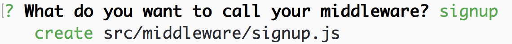

# User Management

In [the previous section](scaffolding.md) we set up a Message service with a `/messages` endpoint. The app we generated also comes with a `/users` endpoint and local authentication. Now we're going learn how we can create users and authenticate them.

## Creating and authenticating users

Although a new user can be created by POSTing to the `/users` endpoint, we're going to create a separate `/signup` endpoint.  This will keep things explicit and also show how you can use regular Express middleware with Feathers.

In this example the fields required for creating a user are `email` and `password`. Feathers automatically hashes passwords using [bcrypt](https://www.npmjs.com/package/bcryptjs).

Feathers Authentication uses [JSON webtoken (JWT)](https://jwt.io/) for secure authentication between a client and server as opposed to cookies and sessions. After we create a user, we'll be able to login.  All we'll need to do is POST the `email` and `password` to the `http://localhost:3030/auth/local` endpoint set up by Feathers authentication. The response will return the authenticated user and their token.

This token needs to be set in the `Authorization` header for any subsequent requests that require authentication. You can find more details in the [authentication chapter](../authentication/readme.md).

When we create a front-end for our chat API this will all be done automatically for us when using the [Feathers client](../clients/feathers.md) by calling `app.authenticate()`.

### Adding HTML pages

For our chat app we will create a static `signup.html` and `login.html` page that shows a form. The form in `signup.html` will POST to the `/signup` entpoint which we will create later and `login.html` will submit to `auth/local` which already exists.

Let's replace `public/index.html` with the following welcome page:

```html
<html>
  <head>
    <meta http-equiv="content-type" content="text/html; charset=utf-8">
    <meta name="viewport" 
      content="width=device-width, initial-scale=1.0, maximum-scale=1, user-scalable=0" />
    <title>Feathers Chat</title>
    <link rel="shortcut icon" href="favicon.ico">
    <link rel="stylesheet" href="//cdn.rawgit.com/feathersjs/feathers-chat/v0.1.0/public/base.css">
    <link rel="stylesheet" href="//cdn.rawgit.com/feathersjs/feathers-chat/v0.1.0/public/chat.css">
  </head>
  <body>
    <main class="home container">
      <div class="row">
        <div class="col-12 col-8-tablet push-2-tablet text-center">
          
          <h3 class="title">Chat</h3>
        </div>
      </div>
      <div class="row">
        <div class="col-12 push-4-tablet col-4-tablet">
          <div class="row">
            <div class="col-12">
              <a href="login.html" class="button button-primary block login">
                Login
              </a>
            </div>
          </div>
          <div class="row">
            <div class="col-12">
              <a href="signup.html" class="button button-primary block signup">
                Signup
              </a>  
            </div>
          </div>
        </div>
      </div>
    </main>
  </body>
</html>
```

`public/login.html` looks like this:

```html
<html>
  <head>
    <meta http-equiv="content-type" content="text/html; charset=utf-8">
    <meta name="viewport"
      content="width=device-width, initial-scale=1.0, maximum-scale=1, user-scalable=0" />
    <title>Feathers Chat</title>
    <link rel="shortcut icon" href="favicon.ico">
    <link rel="stylesheet" href="//cdn.rawgit.com/feathersjs/feathers-chat/v0.1.0/public/base.css">
    <link rel="stylesheet" href="//cdn.rawgit.com/feathersjs/feathers-chat/v0.1.0/public/chat.css">
  </head>
  <body>
    <main class="login container">
      <div class="row">
        <div class="col-12 col-6-tablet push-3-tablet text-center">
          <h1 class="font-100">Welcome Back</h1>
        </div>
      </div>
      <div class="row">
        <div class="col-12 col-6-tablet push-3-tablet col-4-desktop push-4-desktop text-center">
          <form class="form" method="post" action="/auth/local">
            <fieldset>
              <input class="block" type="email" name="email" placeholder="email">
            </fieldset>
            <fieldset>
              <input class="block" type="password"name="password" placeholder="password">
            </fieldset>
            <button type="submit" class="button button-primary block login">
              Login
            </button>
          </form>
        </div>
      </div>
    </main>
  </body>
</html>
```

Finally, `public/signup.html` looks like this:

```html
<html>
  <head>
    <meta http-equiv="content-type" content="text/html; charset=utf-8">
    <meta name="viewport" content="width=device-width, initial-scale=1.0, maximum-scale=1, user-scalable=0" />
    <title>Feathers Chat</title>
    
    <link rel="shortcut icon" href="img/favicon.png">
    <link rel="stylesheet" href="//cdn.rawgit.com/feathersjs/feathers-chat/v0.1.0/public/base.css">
    <link rel="stylesheet" href="//cdn.rawgit.com/feathersjs/feathers-chat/v0.1.0/public/chat.css">
  </head>
  <body>
    <main class="login container">
      <div class="row">
        <div class="col-12 col-6-tablet push-3-tablet text-center">
          <h1 class="font-100">Create an Account</h1>
        </div>
      </div>
      <div class="row">
        <div class="col-12 col-6-tablet push-3-tablet col-4-desktop push-4-desktop text-center">
          <form class="form" method="post" action="/signup">
            <fieldset>
              <input class="block" type="email" name="email" placeholder="email">  
            </fieldset>
            <fieldset>
              <input class="block" type="password" name="password" placeholder="password">
            </fieldset>
            <button type="submit" class="button button-primary block signup">
              Signup
            </button>
          </form>
        </div>
      </div>
    </main>
  </body>
</html>
```

### Signing up new users

Now we have a welcome, login and signup page and we can create a `signup` endpoint that creates a new user from the `signup.html` form submission and then redirects to `login.html`. Because Feathers works just like [Express](http://expressjs.com/) we can just create an [Express middleware](http://expressjs.com/en/guide/using-middleware.html) called `signup` that does that.

```
$ yo feathers:middleware
```



`src/middleware/signup.js` takes the `users` service and creates a new user from the submitted form data. Then redirects to `login.html`:

```js
'use strict';

module.exports = function(app) {
  return function(req, res, next) {
    const body = req.body;

    // Get the user service and `create` a new user
    app.service('users').create({
      email: body.email,
      password: body.password
    })
    // Then redirect to the login page
    .then(user => res.redirect('/login.html'))
    // On errors, just call our error middleware
    .catch(next);
  };
};
```

Now we have to add the `/signup` POST route to `src/middleware/index.js`:

```js
'use strict';

const signup = require('./signup');

const handler = require('feathers-errors/handler');
const notFound = require('./not-found-handler');
const logger = require('./logger');

module.exports = function() {
  // Add your custom middleware here. Remember, that
  // just like Express the order matters, so error
  // handling middleware should go last.
  const app = this;

  app.post('/signup', signup(app));
  app.use(notFound());
  app.use(logger(app));
  app.use(handler());
};
```

> **ProTip:** Just like Express, most middleware should be registered before the `notFound` middleware.

The last step is to change the standard success redirect to `/chat.html` which will show the frontend for our chat application. We can do that by adding `successRedirect` to the `auth` section in `config/default.json`:

```json
{
  "host": "localhost",
  "port": 3030,
  "nedb": "../data/",
  "public": "../public/",
  "auth": {
    "token": {
      "secret": "<your secret>"
    },
    "local": {},
    "successRedirect": "/chat.html"
  }
}
```

After stopping (CTRL + C) and starting the server (`npm start`) again we can go to the signup page, sign up with an email and password which will redirect us to the login page. There we can log in with the information we used to sign up and will get redirected to `chat.html` which currently shows authentication success page with the JWT.


## Authorization

Now that we can authenticate we want to restrict the Message service to only authenticated users. We could have done that already in the service generator by answering _"yes"_ when asked if we need authentication but we can also easily add it manually by changing `src/services/message/hooks/index.js` to:

```js
'use strict';

const globalHooks = require('../../../hooks');
const auth = require('feathers-authentication').hooks;

exports.before = {
  all: [
    auth.verifyToken(),
    auth.populateUser(),
    auth.requireAuth()
  ],
  find: [],
  get: [],
  create: [],
  update: [],
  patch: [],
  remove: []
};

exports.after = {
  all: [],
  find: [],
  get: [],
  create: [],
  update: [],
  patch: [],
  remove: []
};
```

That's it for authentication! We now have a _home_, _login_ and _signup_ page. We can sign up as a new user and log in with their email and password. In the [next section](formatting-and-hooks.md) we will look at creating new messages and adding additional information to them using the authenticated user information.
