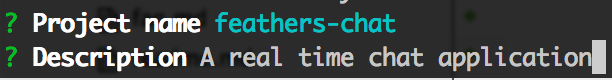
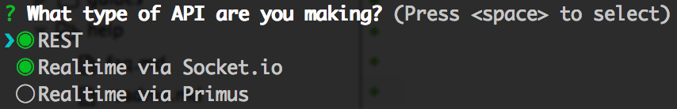
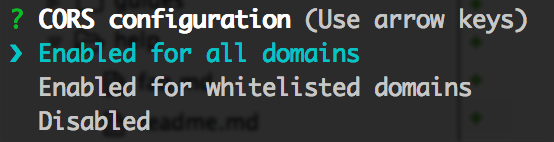
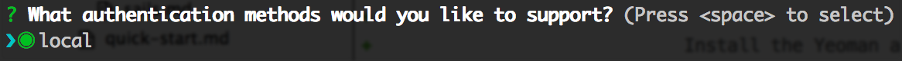

# Your First App

Well alright! Let's build your first Feathers app! We're going to build a real-time chat app with MongoDB as the database. It's a great way to cover all the things that you'd need to do in a real world application and how Feathers can help. It also makes a lot more sense to have a real-time component than a Todo list. 😉

If you've already gone through the [Quick Start](../quick-start.md) section you can skip ahead to [What Just Happened?](#what-just-happened).

## Generate Your App

Make sure you have NodeJS and npm installed. You can grab these from the [NodeJS](https://nodejs.org) website or if you are on OS X and have homebrew installed by running `brew install nodejs`.

Install the Yeoman and the Feathers generator.

> `npm install -g yeoman generator-feathers`

Create a directory for your new app.

> `mkdir feathers-chat; cd feathers-chat/`

Generate your app and follow the prompts.

`yo feathers`

When presented with the project name just hit enter.

Enter in a short description of your app.

You can now choose which providers you want to support. Since we're setting up a real-time REST API we'll go with the default REST and Socket.io. So just hit enter.

You can learn more about Feathers providers in [Providers chapter](../../providers/readme.md).

Next we'll be prompted to support [CORs](https://developer.mozilla.org/en-US/docs/Web/HTTP/Access_control_CORS). This basically allows your client to connect to the sever from wherever. You can whitelist specific domains but again, just hit enter for now.

Now let's choose our database. You can see that Feathers supports a bunch through the generator and we support even more outside the generator. Let's choose MongoDB. You can find out more about our database adapters in the [Databases chapter](../../databases/readme.md).

Since pretty much every app needs authentication of some sort we generate almost everything you need to get going. We currently only support local authentication but have plans for social auth as well.

You can learn more about authentication in Feathers by reading the [Authentication chapter](../../authentication/readme.md).

Your options should all look like this and you should have seen that a whole bunch of files were created.

npm will do it's thing and install your dependencies. Depending on your Internet connection this can take a minute or two. So while this is happening you should start your mongodb instance.

If you are running on OSX or Linux and already have MongoDB installed simply run:

`mongod`

Once your dependencies have been installed you can start your brand new app! 💥

`npm start`

Now open up [localhost:3030](http://localhost:3030) in your browser and you will see your app running.

## What Just Happened

A lot stuff just happened there very quickly. We automatically generated a basic application with a REST and real time API for both [messages](http://localhost:3030/messages) and [users](http://localhost:3030/users). So you now have full CRUD capability using MongoDB for both your `/messages` and `/users` endpoints.

- Show generated folder structure
- Modify user model to support email and password
- Talk about login route
    - We also have set up an authentication service so that you can login by POSTing to `/login`.
- Introduce concept of hooks for hash password
- trying logging (should fail with invalid login)
- Sign up (ie. create a user). This calls the hash password function.
- Use generator to add another before hook to update `updatedAt` for update, patch methods?
- Start coding up the front end. Introduce feathers client, and real-time

