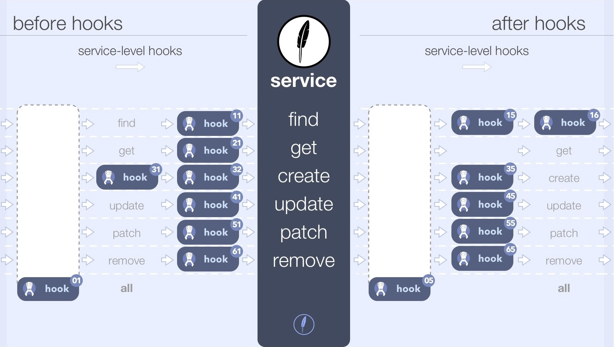

# Hooks

As we have seen in the [previous chapter](./services.md), Feathers services are a great way to implement data storage and modification. Technically, we could implement all our application logic within services but very often an application requires similar functionality across multiple services. For example, we might want to check for all services if a user is allowed to even call the service method or add the current date to all data that we are saving. With just using services we would have to implement this again every time.

This is where Feathers hooks come in. Hooks are pluggable middleware functions that can be registered __before__, __after__ or on __error__s of a service method. You can register a single hook function or create a chain of them to create complex work-flows. 

Just like services themselves, hooks are *transport independent*. They are usually also service agnostic, meaning they can be used with ​*any*​ service. This pattern keeps your application logic flexible, composable, and much easier to trace through and debug.

> __Note:__ A full overview of the hook API can be found in the [hooks API documentation](../../api/hooks.md).

Hooks are commonly used to handle things like validation, authorization, logging, populating related entities, sending notifications and more. 

> __Pro tip:__ For more information about the design patterns behind hooks see [this blog post](https://blog.feathersjs.com/api-service-composition-with-hooks-47af13aa6c01).

## Quick example

Here is a quick example for a hook that adds a `createdAt` property to the data before calling the actual `create` service method:

```js
app.service('messages').hooks({
  before: {
    create (context) {
      context.data.createdAt = new Date();
      
      return context;
    }
  }
})
```

## Hook functions

A hook function is a function that takes the [hook context](#hook-context) as the parameter and returns that context or nothing. Hook functions run in the order they are registered and will only continue to the next once the current hook function completes. If a hook function throws an error, all remaining hooks (and possibly the service call) will be skipped and the error will be returned.

A common pattern to make hooks more re-usable (e.g. making the `createdAt` property name from the example above configurable) is to create a wrapper function that takes those options and returns a hook function:

```js
const setTimestamp = name => {
  return async context => {
    context.data[name] = new Date();

    return context;
  }
} 

app.service('messages').hooks({
  before: {
    create: setTimestamp('createdAt'),
    update: setTimestamp('updatedAt')
  }
});
```

Now we have a re-usable hook that can set the timestamp on any property.

## Hook context

The hook `context` is an object which contains information about the service method call. It has read-only and writable properties. Read-only properties are:

- `context.app` - The Feathers application object
- `context.service` - The service this hook is currently running on
- `context.path` - The path of the service
- `context.method` - The service method
- `context.type` - The hook type (`before`, `after` or `error`)

Writeable properties are:

- `context.params` - The service method call `params`. For external calls, `params` usually contains:
  - `context.params.query` - The query (e.g. query string for REST) for the service call
  - `context.params.provider` - The name of the transport (which we will look at in the next chapter) the call has been made through. Usually `rest`, `socketio`, `primus`. Will be `undefined` for internal calls.
- `context.id` - The `id` for a `get`, `remove`, `update` and `patch` service method call
- `context.data` - The `data` sent by the user in a `create`, `update` and `patch` service method call
- `context.error` - The error that was thrown (in `error` hooks)
- `context.result` - The result of the service method call (in `after` hooks)

> __Note:__ For more information about the hook context see the [hooks API documentation](../../api/hooks.md).

## Registering hooks

The most common way to register hooks is in an object like this:

```js
const messagesHooks = {
  before: {
    all: [],
    find: [],
    get: [],
    create: [],
    update: [],
    patch: [],
    remove: [],
  },
  after: {
    all: [],
    find: [],
    create: [],
    update: [],
    patch: [],
    remove: [],
  }
};

app.service('messages').hooks(messagesHooks);
```

This makes it easy to see at one glance in which order hooks are executed and for which method.

> __Note:__ `all` is a special keyword which means those hooks will run before the method specific hooks in this chain.

For example, if hooks are registered like so:

```js
const messagesHooks = {
  before: {
    all: [ hook01() ],
    find: [ hook11() ],
    get: [ hook21() ],
    create: [ hook31(), hook32() ],
    update: [ hook41() ],
    patch: [ hook51() ],
    remove: [ hook61() ],
  },
  after: {
    all: [ hook05() ],
    find: [ hook15(), hook16() ],
    create: [ hook35() ],
    update: [ hook45() ],
    patch: [ hook55() ],
    remove: [ hook65() ],
  }
};

app.service('messages').hooks(messagesHooks);
```

This diagram illustrates when each hook will be executed:



## Validating data

If a hook throws an error, all following hooks will be skipped and the error will be returned to the user. This makes `before` hooks a great place to validate incoming data by throwing an error for invalid data. We can throw a normal [JavaScript error](https://developer.mozilla.org/en-US/docs/Web/JavaScript/Reference/Global_Objects/Error) or [Feathers error](../../api/errors.md) which has some additional functionality (like returning the proper error code for REST calls). 

`@feathersjs/errors` is a separate module, so you must add it to your project before requiring it:

```bash
npm install @feathersjs/errors --save
```

We will only need the hook for `create`, `update` and `patch` since those are the only service methods that allow user submitted data:

```js
const { BadRequest } = require('@feathersjs/errors');

const validate = async context => {
  const { data } = context;

  // Check if there is `text` property
  if(!data.text) {
    throw new BadRequest('Message text must exist');
  }

  // Check if it is a string and not just whitespace
  if(typeof data.text !== 'string' || data.text.trim() === '') {
    throw new BadRequest('Message text is invalid');
  }

  // Change the data to be only the text
  // This prevents people from adding other properties to our database
  context.data = {
    text: data.text.toString()
  }

  return context;
};

app.service('messages').hooks({
  before: {
    create: validate,
    update: validate,
    patch: validate
  }
});
```


> __Note:__ Throwing an appropriate [Feathers errors](../../api/errors.md) allows to add more information and return the correct HTTP status code.

## Application hooks

Sometimes we want to automatically add a hook to every service in our Feathers application. This is what application hooks can be used for. They work the same as service specific hooks but run in a more specific order:

- `before` application hooks will always run _before_ all service `before` hooks
- `after` application hooks will always run _after_ all service `after` hooks
- `error` application hooks will always run _after_ all service `error` hooks

## Error logging

A good use for application hooks is to log any service method call error. The following example logs every service method error with the path and method name as well as the error stack:

```js
app.hooks({
  error: {
    all: async context => {
      console.error(`Error in '${context.path}' service method '${context.method}'`, context.error.stack);
    }
  }
});
```

## More examples

The [chat application guide](../chat/readme.md) will show several more examples like how to associate data and adding user information for hooks created by [the generator](./generator.md).

## What's next?

In this chapter we learned how Feathers hooks can be used as middleware for service method calls to validate and manipulate incoming and outgoing data without having to change our service. In the next chapter we will turn our messages service into a [fully functional REST API](./rest.md).
