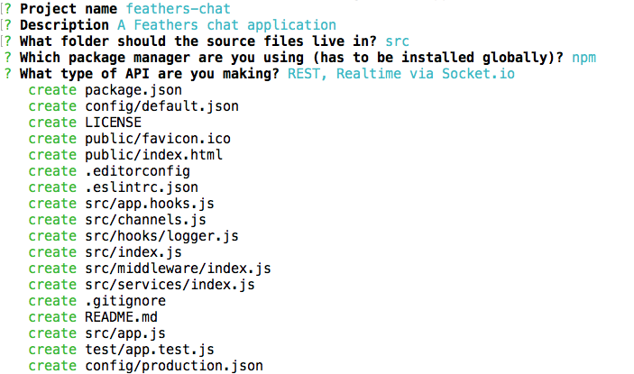

# Creating the application

In this part we are going to create a new Feathers application using the generator.

## Generating the application

With everything [set up]() let's create a directory for our new app:

```
$ mkdir feathers-chat
$ cd feathers-chat/
```

Now we can generate the application:

```
$ feathers generate app
```

When presented with the project name just hit enter, or enter a name (no spaces).

Next, enter in a short description of your app.

The next prompt asking for the source folder can be answered by just hitting enter. This will put all source files into the `src/` folder.

The next prompt will ask for the package manager you want to use. The default is the standard [npm](https://www.npmjs.com/).

> **Note:** Choosing [Yarn](https://yarnpkg.com/en/) will make for faster installation times but requires Yarn installed globally via `npm install yarn -g` first.

You're now presented with the option to choose which transport you want to support. Since we're setting up a real-time and REST API we'll go with the default REST and Socket.io options. So just hit enter.

Once you confirm the final prompt you will see something like this:



The structure and purpose of all those files that have just been created are covered in the [generator chapter](../step-by-step/generators/readme.md).

## Running the server and tests

The server can now be started by running

```
npm start
```

After that, you can see a welcome page at [localhost:3030](http://localhost:3030). When making modifications, remember to stop (CTRL + C) and start the server again.

The app also comes with a set of basic tests which can be run with

```
npm test
```

## What's next?

We scaffolded a new Feathers application. The next step is to [create a service for messages](./service.md).
