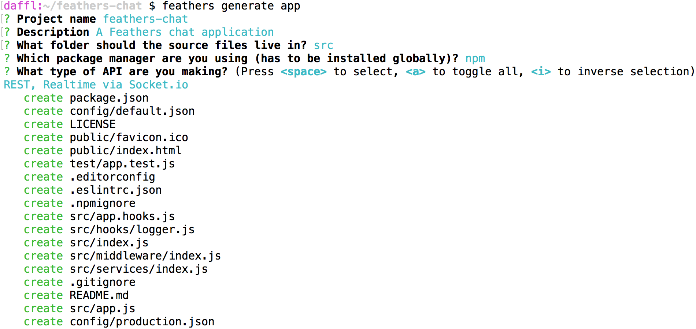

# Creating the application

In this part we are going to create a new Feathers application using the generator. We can install the generator via:

```
npm install @feathersjs/cli -g
```

> __Important:__ The prerequisites for this guide are the same as the [basics prerequisites](../basics/setup.md). This means that Node 8.0.0 (`node --version`) or later is required.

## Generating the application

With everything [set up](../basics/setup.md), let's create a directory for our new app:

```
$ mkdir feathers-chat
$ cd feathers-chat/
```

Now we can generate the application:

```
$ feathers generate app
```

When presented with the project name, just hit enter, or enter a name (no spaces).

Next, write a short description of your application.

The next prompt asking for the source folder can be answered by just hitting enter. This will put all source files into the `src/` folder.

The next prompt will ask for the package manager you want to use. The default is the standard [npm](https://www.npmjs.com/).

> **Note:** If you choose [Yarn](https://yarnpkg.com/en/) instead, make sure it has been installed via `npm install yarn -g` first.

You're now presented with the option of which transport you want to support. Since we're setting up a real-time and REST API, we'll go with the default REST and Socket.io options. So just hit enter.

Once you confirm the final prompt, you will see something like this:



## The generated files

Let's have a brief look at the files that have been generated:

* `config/` - Contains the configuration files for the app. `production.json` files override `default.json` when in production mode by setting `NODE_ENV=production`. For details, see the [configuration API documentation](../../api/configuration.md).
* `node_modules/` - The generator installs the project dependencies either using
  [npm](https://docs.npmjs.com/), or [yarn](https://yarnpkg.com/en/). The dependencies are also added in the `package.json`.
* `public/` - Contains static files to be served. A sample favicon and `index.html` (which will show up when going directly to the server URL) are already included.
* `src/` - Contains the Feathers server code.
  * `hooks/` contains our custom [hooks](../basics/hooks.md). A simple `logger` hook for logging debug information about our service calls is already included
  * `middleware/` contains any [Express middleware](http://expressjs.com/en/guide/writing-middleware.html)
  * `services/` contains our [services](../basics/services.md)
  * `index.js` loads and starts the application
  * `app.js` configures our [Feathers application](../basics/starting.md)
  * `app.hooks.js` contains hooks that apply to every service.
  * `channels.js` sets up Feathers [event channels](../../api/channels.md)
* `test/` - Contains [Mocha](https://mochajs.org/) test files for the app, hooks and services
  * `app.test.js` tests that the index page appears, as well as 404 errors for HTML pages and JSON
* `.editorconfig` is an [EditorConfig](http://editorconfig.org/) setting to help developers define and maintain consistent coding styles among different editors and IDEs.
* `.eslintrc.json` contains defaults for linting your code with [ESLint](http://eslint.org/docs/user-guide/getting-started).
* `.gitignore` - specifies [intentionally untracked files](https://git-scm.com/docs/gitignore) which [git](https://git-scm.com/), [GitHub](https://github.com/) and other similar projects ignore.
* `.npmignore` specifies [files which are not to be published](https://docs.npmjs.com/misc/developers#keeping-files-out-of-your-package) for distribution.
* `LICENSE` - contains the License so that people know how they are permitted to use it, and any restrictions you're placing on it. It defaults to the Feathers license.
* `package.json` contains [information](https://docs.npmjs.com/files/package.json) about our project which [npm](https://docs.npmjs.com/), [yarn](https://yarnpkg.com/en/) and other package managers need to install and use your package.

## Running the server and tests

The server can now be started by running

```
npm start
```

After that, you can see a welcome page at [localhost:3030](http://localhost:3030). When making modifications, remember to stop (CTRL + C) and start the server again.

The app also comes with a set of basic tests which can be run with

```
npm test
```

## What's next?

We scaffolded a new Feathers application. The next step is to [create a service for messages](./service.md).
