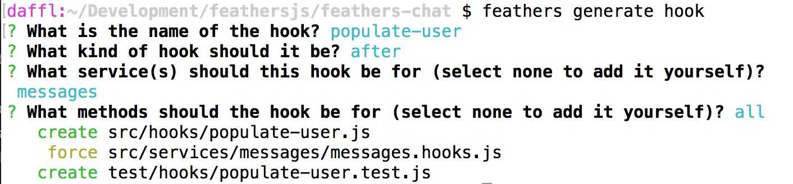

# Processing data

Now that we can [create and authenticate users](./authentication.md), we are going to process data, sanitize the input we get from the client and add additional information.

## Sanitizing new message

When creating a new message, we automatically sanitized our input, add the user that sent it and include the date the message has been created before saving it in the database. This is where [hooks](../basics/hooks.md) come into play. In our case specifically a *before* hook. To create a new hook we can run:

```
feathers generate hook
```

The hook we want to create will be called `process-message`. Since we want to pre-process our data, the next prompt asking for what kind of hook, we will choose `before` from the list (and confirming enter).

Next we will see a list of all our services we can add this hook to. For this hook we will only choose the `messages` service (navigate to the entry with the arrow keys and select it with the space key).

A hook can run before any number of [service methods](../../api/services.md). For this specific hook we will only select `create`. After confirming the last prompt we will see something like this:


This will create our hook and wire it up to the service we selected. Now it is time to add some code. Update `src/hooks/process-message.js` to look like this:

```js
// Use this hook to manipulate incoming or outgoing data.
// For more information on hooks see: http://docs.feathersjs.com/api/hooks.html

module.exports = function (options = {}) { // eslint-disable-line no-unused-vars
  return async context => {
    const { data } = context;

    // Throw an error if we didn't get a text
    if(!data.text) {
      throw new Error('A message must have a text');
    }

    // The authenticated user
    const user = context.params.user;
    // The actual message text
    const text = context.data.text
      // Messages can't be longer than 400 characters
      .substring(0, 400);

    // Override the original data (so that people can't submit additional stuff)
    context.data = {
      text,
      // Set the user id
      userId: user._id,
      // Add the current date
      createdAt: new Date().getTime()
    };

    // Best practise, hooks should always return the context
    return context;
  };
};
```

This will do several things:

1. Check if there is a `text` in the data and throw an error if not
2. Truncate the messages `text` property to 400 characters
3. Update the data submitted to the database to contain
  - The new truncated text
  - The currently authenticated user (so we always know who sent it)
  - The current (creation) date 

## Adding a user avatar

Let's create another hook that adds a link to the [Gravatar](http://en.gravatar.com/) image of the users email address so we can show an avatar. After running

```
feathers generate hook
```

The selections are almost the same as our previous hook:

- The hook will be called `gravatar`
- It will be a `before` hook
- On the `users` service
- For the `create` method


Then we update `src/hooks/gravatar.js` with the following code:

```js
// Use this hook to manipulate incoming or outgoing data.
// For more information on hooks see: http://docs.feathersjs.com/api/hooks.html

// We need this to create the MD5 hash
const crypto = require('crypto');

// The Gravatar image service
const gravatarUrl = 'https://s.gravatar.com/avatar';
// The size query. Our chat needs 60px images
const query = 's=60';

module.exports = function (options = {}) { // eslint-disable-line no-unused-vars
  return async context => {
    // The user email
    const { email } = context.data;
    // Gravatar uses MD5 hashes from an email address to get the image
    const hash = crypto.createHash('md5').update(email).digest('hex');

    context.data.avatar = `${gravatarUrl}/${hash}?${query}`;

    // Best practise, hooks should always return the context
    return context;
  };
};
```

Here we use [Node's crypto library](https://nodejs.org/api/crypto.html) to create an MD5 hash of the users email address. This is what Gravatar uses as the URL for the avatar of an email address. If we now create a new user it will add the link to the image in the `gravatar` property.

## Populating the message sender

In the `process-message` hook we are currently just adding the users `_id` as the `userId` property in the message. We want to show more than the `_id` in the UI, so we'll need to populate more data in the message response. In order to show the right user information we want to include that information in our messages.

For that we create another hook:

- The hook will be called `populate-user`
- It will be an `after` hook
- On the `messages` service
- For `all` methods



Once created we can update `src/hooks/populate-user.js` to:

```js
// Use this hook to manipulate incoming or outgoing data.
// For more information on hooks see: http://docs.feathersjs.com/api/hooks.html

module.exports = function (options = {}) { // eslint-disable-line no-unused-vars
  return async context => {
    // Get `app`, `method`, `params` and `result` from the hook context
    const { app, method, result, params } = context;

    // Make sure that we always have a list of messages either by wrapping
    // a single message into an array or by getting the `data` from the `find` method result
    const messages = method === 'find' ? result.data : [ result ];

    // Asynchronously get user object from each messages `userId`
    // and add it to the message
    await Promise.all(messages.map(async message => {
      // We'll also pass the original `params` to the service call
      // so that it has the same information available (e.g. who is requesting it)
      const user = await app.service('users').get(message.userId, params);

      message.user = user;
    }));

    // Best practise, hooks should always return the context
    return context;
  };
};
```

> __Note:__ `Promise.all` makes sure that all the calls run in parallel instead of waiting for each one to finish.

## What's next?

In this section we added three hooks to pre- and postprocess our message and user data. We now have a complete API to send and retrieve messages including authentication.

See the [frameworks section](../frameworks/readme.md) for more resources on specific frameworks like React, React Native, Angular or VueJS.  You'll find guides for creating a complete chat frontend with signup, logging, user listing and messages.  There are also links to full example chat applications built with some popular frontend frameworks.

You can also browse the [API](../../api/readme.md) which has a lot of information on the usage of Feathers and its database adaptors.
