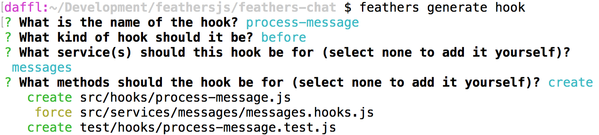
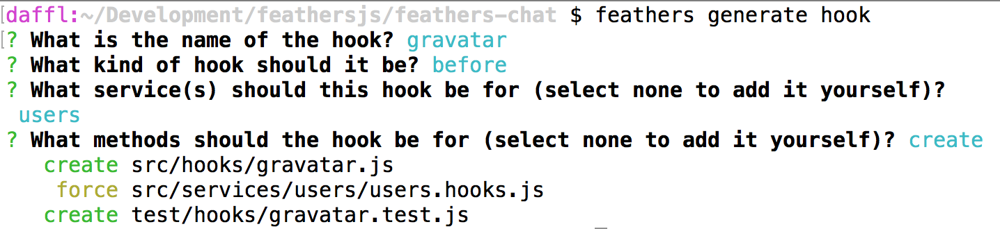

# Processing data

Now that we can [create and authenticate users](./authentication.md), we are going to process data, sanitize the input we get from the client and add additional information.


## Sanitizing new message

When creating a new message, we automatically want to sanitize HTML input, add the user that sent it and include the date the message has been created before saving it in the database. This is where hooks come into play, in our case specifically a *before* hook. To create a new hook we can run:

```
feathers generate hook
```

The hook we want to create will be called `process-message`. Since we want to pre-process our data, the next prompt asking for what kind of hook, we will choose `before` from the list.

Next we will see a list of all our services we can add this hook to. For this hook we will only choose the `messages` service (navigate to the entry with the arrow keys and select it with the space key).

A hook can run before any number of [service methods](../../api/services.md), for this one we will only select `create`. After confirming the last prompt we will see something like this:



This will create our hook and wire it up to the service we selected. Now it is time to add some code. Update `src/hooks/process-message.js` to look like this:

```js
'use strict';

// Use this hook to manipulate incoming or outgoing data.
// For more information on hooks see: http://docs.feathersjs.com/api/hooks.html

module.exports = function() {
  return function(context) {
    // The authenticated user
    const user = context.params.user;
    // The actual message text
    const text = context.data.text
      // Messages can't be longer than 400 characters
      .substring(0, 400)
      // Do some basic HTML escaping
      .replace(/&/g,'&amp;').replace(/</g,'&lt;').replace(/>/g,'&gt;');

    // Override the original data
    context.data = {
      text,
      // Set the user id
      userId: user._id,
      // Add the current time via `getTime`
      createdAt: new Date().getTime()
    };

    // Hooks can either return nothing or a promise
    // that resolves with the `context` object for asynchronous operations
    return Promise.resolve(context);
  };
};
```

This will do several things:

1. Truncate the messages `text` property to 400 characters and do some basic HTML escaping.
2. Update the data submitted to the database to contain
  - The new truncated and sanitized text
  - The currently authenticated user (so we always know who sent it)
  - The current (creation) date 
3. Return a Promise that resolves with the context object (this is what any hook should return)


## Adding a user avatar

Let's create one more hook that adds a link to the [Gravatar](http://en.gravatar.com/) image of the users email address so we can show an avatar. After running

```
feathers generate hook
```

The selections are almost the same as our previous hook:

- The hook will be called `gravatar`
- It will be a `before` hook
- On the `users` service
- For the `create` method



Then we update `src/hooks/gravatar.js` with the following code:

```js
'use strict';

// Use this hook to manipulate incoming or outgoing data.
// For more information on hooks see: http://docs.feathersjs.com/api/hooks.html

// We need this to create the MD5 hash
const crypto = require('crypto');

// The Gravatar image service
const gravatarUrl = 'https://s.gravatar.com/avatar';
// The size query. Our chat needs 60px images
const query = 's=60';

module.exports = function() {
  return function(context) {
    // The user email
    const { email } = context.data;
    // Gravatar uses MD5 hashes from an email address to get the image
    const hash = crypto.createHash('md5').update(email).digest('hex');

    context.data.avatar = `${gravatarUrl}/${hash}?${query}`;

    // Hooks can either return nothing or a promise
    // that resolves with the `context` object for asynchronous operations
    return Promise.resolve(context);
  };
};
```

Here we use [Node's crypto library](https://nodejs.org/api/crypto.html) to create an MD5 hash of the users email address. This is what Gravatar uses as the URL for the avatar of an email address. If we now create a new user it will add the link to the image in the `gravatar` property.


## Populating the message sender

In the `process-message` hook we are currently just storing the users `_id` in the message. We want to show more than the `_id` in the UI, so we'll need to populate more data in the message response. In order to show the right user information we want to include that information in our messages.

We could do this by creating our own hook but adding related entities is quite common and already implement in the [populate common hook](/api/hooks-common.html#populate). In order to use the hook we have to update the `src/services/messages/messages.hooks.js` file to look like this:

```js
'use strict';

const { authenticate } = require('feathers-authentication').hooks;
const { populate } = require('feathers-hooks-common');
const processMessage = require('../../hooks/process-message');

module.exports = {
  before: {
    all: [ authenticate('jwt') ],
    find: [],
    get: [],
    create: [ processMessage() ],
    update: [ processMessage() ],
    patch: [ processMessage() ],
    remove: []
  },

  after: {
    all: [
      populate({
        schema: {
          include: [{
            service: 'users',
            nameAs: 'user',
            parentField: 'userId',
            childField: '_id'
          }]
        }
      })
    ],
    find: [],
    get: [],
    create: [],
    update: [],
    patch: [],
    remove: []
  },

  error: {
    all: [],
    find: [],
    get: [],
    create: [],
    update: [],
    patch: [],
    remove: []
  }
};
```

This will include the `user` property using the `userId`, retrieving it from the `users` service to all messages.

You can learn more about how the `populate` hook works by checking out the API docs for [`feathers-hooks-common`](/api/hooks-common.md).


## What's next?

In this section we added three hooks to pre- and postprocess our message and user data. We now have a complete API to send and retrieve messages including authentication.

See the [frameworks section](../frameworks/readme.md) for more resources on specific frameworks like React, React Native, Angular or VueJS.  You'll find guides for creating a complete chat frontend with signup, logging, user listing and messages.  There are also links to full example chat applications built with some popular frontend frameworks.

You can also browse the [API](../../api/readme.md) which has a lot of information on the usage of Feathers and its database adaptors.

