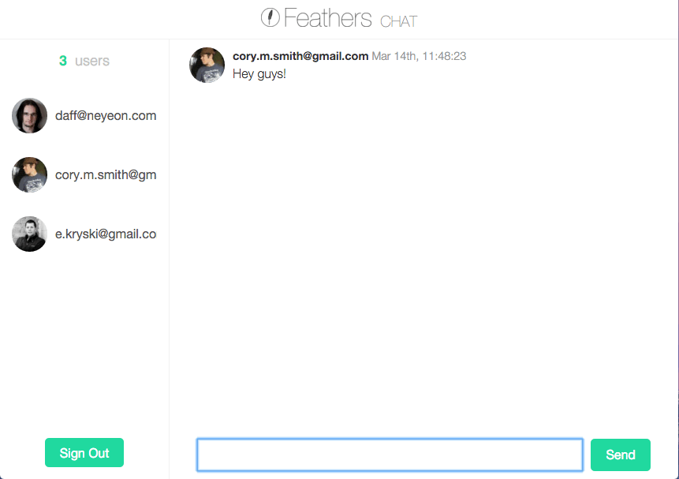

# Creating a Chat Application

Well alright! Let's build our first Feathers app! We're going to build a real-time chat app with [NeDB](https://github.com/louischatriot/nedb) as the database. It's a great way to cover all the things that you'd need to do in a real world application and how Feathers can help. It also makes a lot more sense to have a real-time component than a Todo list. :wink:

In this tutorial you go from nothing to a real-time chat app complete with signup, login, token based authentication and authorization all with a RESTful and real-time API.

You can find a complete working example [here](https://github.com/feathersjs/feathers-chat).

[**Creating the application**](./creating.md)

Create a new application using the generator.

[**Generating a service**](./service.md)

Add an API endpoint to store messages.

[**Building a frontend**](./frontend.md)

Learn how to use Feathers in the browser by creating a small real-time chat frontend.

[**Adding Authentication**](./authentication.md)

Add user registration and login.

[**Processing data**](./processing.md)

Add and sanitize data.
