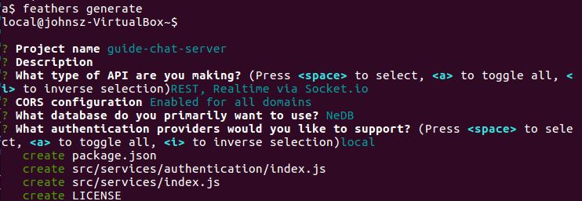
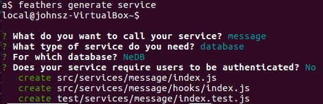
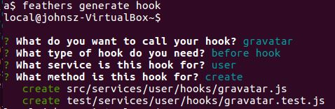

# Starting the server

The server needs authentication, which automatically creates `users`, and `messages`.
Let's handle the user avatar also.

### Working example

- Source code: [examples/chat/server/start](https://github.com/feathersjs/feathers-guide/tree/master/examples/chat/server/start)
- Run it: `node ./examples/chat/server/start/src`

### Basic scaffolding

We will use the generator to get started. (Read the [Generator Guide](guides/step-by-step/generators/readme.md) if you haven't already.)
```text
mkdir examples/chat/server/start
cd examples/chat/server/start
start$ feathers generate
```


This generated the
[authentication](https://github.com/feathersjs/feathers-guide/blob/master/examples/chat/server/start/src/services/authentication/index.js)
and
[users](https://github.com/feathersjs/feathers-guide/tree/master/examples/chat/server/start/src/services/user)
services.
Now, let's generate the
[messages](https://github.com/feathersjs/feathers-guide/tree/master/examples/chat/server/start/src/services/message)
service with:



Finally, we generate a
[hook](https://github.com/feathersjs/feathers-guide/blob/master/examples/chat/server/start/src/services/user/hooks/gravatar.js)
that we will later use to handle the user avatar.



### Clearing the database

Let's add code to
[examples/chat/server/start/src/app.js](https://github.com/feathersjs/feathers-guide/blob/master/examples/chat/server/start/src/app.js)
to clear the database each time this basic server is run.
This'll help prevent confusion should the server be started multiple times.

```javascript
// examples/chat/server/start/src/app.js
app.service('/users').remove(null)
  .then(() => console.log('users table cleared.'))
  .catch(err => console.log('ERROR clearing users table:', err));

app.service('/messages').remove(null)
  .then(() => console.log('messages table cleared.'))
  .catch(err => console.log('ERROR clearing messages table:', err));
```

- `service.remove(null)` deletes all of that service's items.

> **Remove.** You have to be careful not to accidentally pass `null`.
One way to protect yourself is by using the `disableMultiItemChange` hook.

### Running the server

Start the server with `node ./examples/chat/server/start/src` and you will see:
```text
Feathers application started on localhost:3030
users table cleared.
messages table cleared.
```

Let's exercise the server with these
[curl](http://www.slashroot.in/curl-command-tutorial-linux-example-usage)
commands:
[import](../../../examples/chat/server/start/curl-requests.sh)

Run them on another terminal with `./examples/chat/server/start/curl-requests.sh`
and the following is displayed:

```text
feathers-guide$ ./examples/chat/server/start/curl-requests.sh
POST user john@gmail.com
{"email":"john@gmail.com","avatar":"https://s.gravatar.com/avatar/1f9d9a9efc2f523b2f09629444632b5c?s=60","_id":"WZl8x0bsbP5JW1Po"}
POST message Hello.
{"text":"Hello.","_id":"ObRdBmk5joooylTx"}
POST message Hello again!
{"text":"Hello again!","_id":"KZ2Kjp9nnGMta8zP"}
POST message Anyone there?
{"text":"Anyone there?","_id":"tcjSjPZQx8JoUCrz"}
```

The password is not displayed due as the
[user hook module](https://github.com/feathersjs/feathers-guide/blob/master/examples/chat/server/start/src/services/user/hooks/index.js)
contains remove as an after hook.

### Is anything wrong, unclear, missing?
[Leave a comment.](https://github.com/feathersjs/feathers-guide/issues/new?title=Comment:Chat-Server-Start-server&body=Comment:Chat-Server-Start-server)
