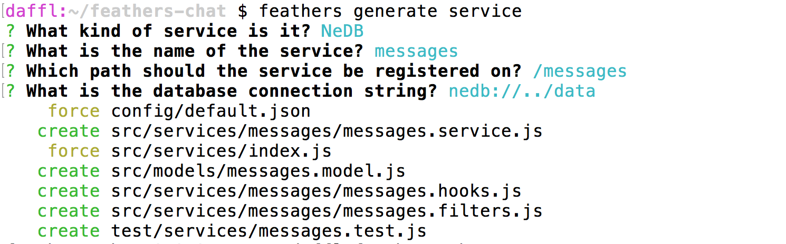

# Creating a service

Now that we have our [Feathers application generated](./creating.md) we can create a new API endpoint to store messages.

## Generating a service

In Feathers any API endpoint is represented as a [service](../../api/services.md) which we already learned about in the [basics guide](../step-by-step/readme.md). To generate a new service we can run

```
feathers generate service
```

First we have to choose what kind of service we would like to create. You can choose between many databases and ORMs but for this guide we will just go with the default [NeDB](https://github.com/louischatriot/nedb). NeDB is a database that stores its data locally in a file and requires no additional configuration or a database server running.

Next we are asked for the name of the service which we can answer with `messages` and then can answer the next question for the path with the default (`/messages`) by pressing enter.

The database connection string (in the case of NeDB the name of the path where it should store its database files) can also be answered with the default.

Confirming the last prompt will create a couple of files and wire our service up:



Et voilà! We have a fully functional REST and real-time API for our messages.


## Testing the API

If we now start our API with

```
npm start
```

We can go to [localhost:3030/messages](http://localhost:3030/messages) and will see an (empty) response from our new messages service.

We can also `POST` new messages and `PUT`, `PATCH` and `DELETE` existing messages (via `/messages/<_id>`), for example from the command line using [CURL](https://curl.haxx.se/):

```
curl 'http://localhost:3030/messages/' -H 'Content-Type: application/json' --data-binary '{ "name": "Curler", "text": "Hello from the command line!" }'
```

Or with a REST client, e.g. [Postman](https://chrome.google.com/webstore/detail/postman/fhbjgbiflinjbdggehcddcbncdddomop?hl=en) using this button:

[](https://app.getpostman.com/run-collection/9668636a9596d1e4a496)

If we now go to [localhost:3030/messages](http://localhost:3030/messages) again we will see the newly created message(s).

## What's next?

With just one command, we created a fully functional REST and real-time API endpoint. Before we dive into authentication and processing data, [let's create a simple web application](./frontend.md) that uses our new chat message endpoint.

