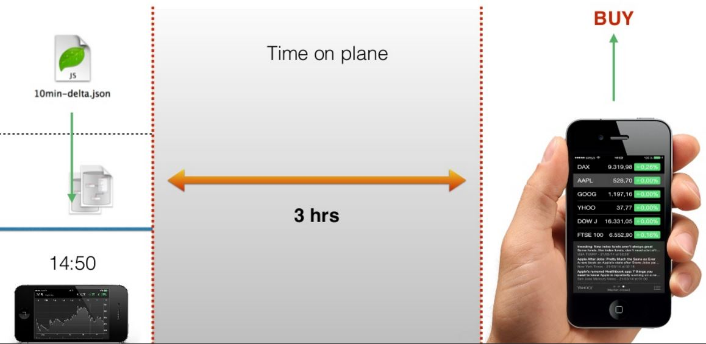

# Own-data and Own-net

## What are the own-data and own-net strategies?

The core data for many mobile applications is unique to the user using the application.
Since no one other than the user can change that user's data,
the client can safely mutate the remote data without concern that anyone is doing the same at that same time.

While the client is disconnected, both strategies queue mutation events for later processing when reconnected.
The difference between them is what they queue.

Own-data queues every mutation event on the client service, and it will later process each mutation in order on the remote service.
The remote service can react to every mutation.
It may, for example, run hooks which send emails on certain mutations.

Own-net queues the net change for each record.
If a record is patched 5 times, own-net queues the record contents after the last of the changes.
If a record is created, patched and finally removed, the remote service will not see the mutations at all.

Own-net uses less storage on the client,
and it reduces the load on the remote service upon reconnection.

> Once the queue is processed, a snapshot refreshes the client's replica, bringing it up to date.

## Own-data Case Study

The realtime case study involved displaying historical stock prices.
Let's now allow the user to buy shares for his own portfolio.

The user will be disconnected if he takes a plane trip,
and he will no longer receive stock price updates.

However he can still make stock purchases.
They will be sent to the server when he reconnects after landing.

#### Sources:

- (**) [MarinTodorov](https://www.slideshare.net/MarinTodorov/overcome-your-fear-of-implementing-offline-mode-in-your-apps?next_slideshow=1)
