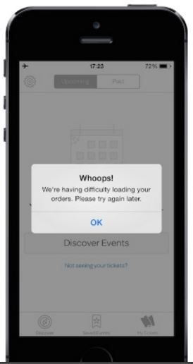
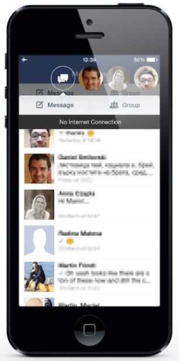
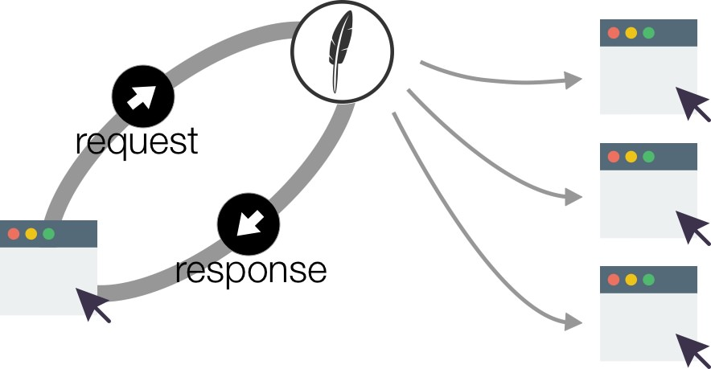

# Offline First

## The Landscape

Customers are increasingly purchasing goods and services using smartphones, either through native or web applications. And, they want to make these purchases wherever they may be, whether it’s inside trains, in the countryside or roaming in foreign countries.

However, mobile networks are still known to be unreliable. Even in highly covered areas and with modern networks, you still encounter high latency and network failure rates. But it’s not just the network at fault here: the customer experience for failure rates also depends on how a given application deals with being offline.

In one extreme end of the quality spectrum, you have an application that, when a network error occurs, the application presents the user with a crude error message and no clue of how to recover.

On the opposite end of the spectrum are applications that automatically deal with network failures — this is the good end of the spectrum.

(*)

## What is Offline First?

Offline first is a way of building applications where having network connectivity is an enhancement, not a necessity. Instead of building applications with the always-on desktop mindset, when you build applications in which the default mode is offline, you’re prone to deliver a better overall customer experience.

Offline first techniques and technologies exist to prepare an application to deliver a good experience to customers while it’s offline.
 
(*)

## Client has Local Data

The only way that an application can access data while it’s offline is, of course, to store that data locally.

Your application prefers reading from the local source, while that local data is updated from remote sources.

## The First Generation of Offline First (*)

Some database technologies exist that work on the client side. SQLite is the reference of embeddable databases and it’s often used on native applications. In the web realm, PouchDB offers a document store on top of the storage the browser offers. PouchDB also has some nice features —  it can sync with a back-end CouchDB server, Cloudant, a PouchDB Node.js server or any other database that implements the CouchDB replication protocol.

In this architecture, each client has its own dedicated database, which is then replicated to a dedicated database on the back-end. Each database may then contain the customer documents. (A document is a JSON object that may contain any arbitrary data).

One database per customer may sound strange to people who are used to relational databases, but it’s a usual pattern when using CouchDB and variants. It’s also a way to clearly and naturally separate and enforce which data a user has access to.

When a change happens on the client or on the server, the sync protocol kicks in and tries to replicate that change to the other side. If no network connection is possible at that time, the client will try to reconnect. Once a connection is possible, both databases will be able to talk to each other and synchronize.

In this architecture, both the client and the server can make changes to the data concurrently. If a conflict arises for a given document, the replication protocol makes sure that both databases converge to the same version of that document. When a conflict happens, Pouch and CouchDB keep all the conflict data around. If the programmer so wishes, they can solve that conflict with any strategy they deem correct and that minimizes data loss.

(*)

## Issues

One database per customer is logically reasonable for many mobile applications as customers don't interact in such applications.
However a successful application may end up having thousands of databases, one for each of its thousands of customers.
You can use tools, such as those provided by IBM, which maintain only one database but makes it look like many individual CouchDB databases.

A second issue is that the remote and local databases synchronize by replication.
The only way to make replication realtime is to start a synchronization cycle every time any data changes on either the remote of the local database.

This is overhead to consider even when you have one database per client.
When the same data is shared by clients, providing realtime updates to all of them is problematic, 
as a replication cycle is needed for each client.

## Feathers Offline First

Feathers has unique foundational features which are useful for implementing offline first.

First, local applications can easily mutate remote databases.
This means we can add a hook to a local database so that, whenever it is locally mutated, the hook can optimistically mutate the remote database.

Second, local applications know when a remote database is mutated as that mutation emits a Feathers realtime event on the client.

Feathers Offline First therefore reacts in realtime when connected, employing a replication strategy only when disconnected.
This makes applications using it less sluggish.

Importantly, Feathers Offline First allows a client database to reflect only a portion of the remote database.
So information for all customers can reside in one database, with each client seeing only those items its allowed to.

## No universal solution

There is no one universal solution to implementing offline first. The end.

For each application, you have to:
- assess the problem
- determine the correct solution
- implement the right code

> In this order please!

Many mobile applications only need a read-only local database which is infrequently refreshed.
Why would you implement a complex replication strategy in such cases?

Feathers Offline First provides several strategies for implementing offline first.
Determine your application's needs and then choose the simplest strategy which satisfies them.

#### Sources:

- (*) [Pedro Teixeira](https://thenewstack.io/build-better-customer-experience-applications-using-offline-first-principles/)
