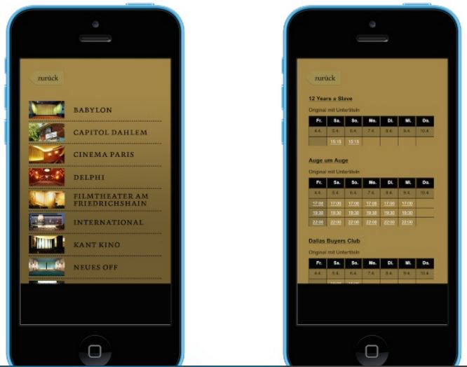
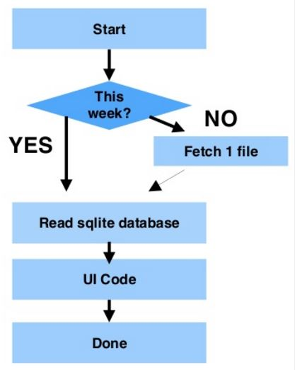

# Snapshot

## What is the Snapshot strategy?

Snapshot distributes data exactly as it appears at a specific moment in time and does not monitor for updates to the data.
When synchronization occurs, the entire snapshot is generated and sent to client service.

> Snapshot can be used by itself, but the snapshot process is also commonly used to provide the initial set of data for all the other strategies.

Using Snapshot by itself is most appropriate when one or more of the following is true:
- Data changes infrequently.
- It is acceptable to have copies of data that are out of date with respect to the remote service for a period of time.
- Replicating small or medium volumes of data.
- A large volume of changes occurs over a short period of time.
- Keep the current values after having lost connection for some time.

Snapshot replication is most appropriate when data changes are substantial but infrequent.
For example, if a sales organization maintains a product price list and the prices are all updated at the same time once or twice each year,
replicating the entire snapshot of data after it has changed is recommended.
Given certain types of data, more frequent snapshots may also be appropriate.
For example, if a relatively small table is updated on a remote service during the day,
but some latency is acceptable, changes can be delivered nightly as a snapshot.

Snapshot has a lower continuous overhead on both the client and the remote than the other strategies,
because incremental changes are not tracked.
However, if the dataset set is very large,
it will require substantial resources to generate and apply the snapshot.
Consider the size of the entire data set and the frequency of changes to the data when evaluating whether to utilize snapshot replication.

(*)

## Snapshot Case Study

Let's consider a mobile application for movie cinemas, which lists show times.

Let's assess the data problem.
- Cinemas change once a year.
- The schedule changes every Thursday.
- The static information rarely changes.
- We need to support ticket reservations.
- We don't need past data.

Let's look at the data. We need:
- 12 cimema photos + their names + coordinates
- 25 film posters + film names
- 30 movie times for each cinemas

This is about 7k of files and 2M of photos, which takes less space than 1 Facebook photo.

The problem definition contains the solution:

The snapshot strategy is the simplest one to satisfy the needs.

How about ticket reservations? You got to do some things online!
However, you can still give a telephone number.

(**)

#### Sources:

- (*) [Microsoft](https://docs.microsoft.com/en-us/sql/relational-databases/replication/snapshot-replication)
- (**) [MarinTodorov](https://www.slideshare.net/MarinTodorov/overcome-your-fear-of-implementing-offline-mode-in-your-apps?next_slideshow=1)
