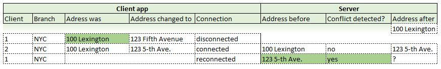
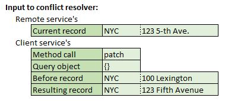
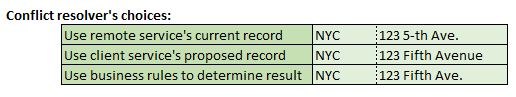
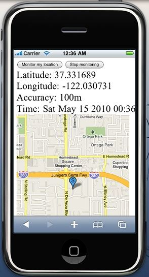
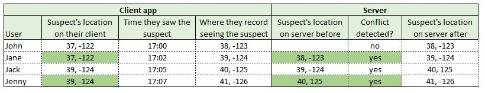

# Sync-data and Sync-net

## What are the sync-data and sync-net strategies?

More complex applications may allow multiple users to mutate the same data on the remote service.
sync-data and sync-net are similar to own-data and own-net, however they detect mutation conflicts
and help the server resolve them.

Each queue entry contains the contents of the record before the mutation.
So each queue-entry for sync-data contains what the record contained on the client before each mutation.
Each entry for sync-net contains what the record contained before the series of mutations.

The remote service, when processing the queued entries,
compares what the client service record contained before the mutation to what the remote service's record currently contains.

If the two are the same, then the client changed a record identical to what the remote currently has.
There is no conflict and the mutation may be performed on the remote.

Let's say the user of one client device went on a plane trip and was offline for some time.
During that time the user changed the addresses of several branch offices,
in particular the NYC one from `100 Lexington` to `123 Fifth Avenue`.
In the meantime another user changed the address to `123 5-th Ave.`.

The queued mutations will be processed once the user reconnects after his flight.
The only conflict to occur will be for the NYC office.
The mutation from `100 Lexington` to `123 Fifth Avenue` conflicts with the record now being `123 5-th Ave.` on the remote service.

The remote service's `conflict resolver function` will be called with:
- the remote service's current record.
- the client service's method call, e.g. 'create', 'update', ...
- the client service's query object.
- the client service's before record.
- the record the client service wants to mutate to.

The resolver may indicate:
- the current remote service's record is to be retained.
- the remote service's record should be mutated to the client service's record.
- what the contents of the record should now be.

This allows the remote service great control over conflicts.
However, in your particular use case, it may be appropriate to adapt a last-mutation-wins strategy
and also use the client service's mutation.

Other use cases may require analyzing the contents of the two records and applying business rules.

## Sometimes own-data is sufficient

Let's say a portion of your [Neighborhood Watch](https://en.wikipedia.org/wiki/Neighborhood_watch) app
allows residents to report the location of a suspect in realtime,
while the neighborhood waits for law enforcement to arrive.
Your app may allow residents to update the suspect's location by using the mobile's geolocation.

You may decide, after assessing the application needs and legal requirements,
to maintain only one record which contains only the suspect's latest location.
All the residents will be updating this one record.

In this use case, although many clients are updating the same record,
you might not care about detecting mutation conflicts among the various clients.
The app just cares about the latest sighting.

You have two choices.
- You could use the sync-data strategy with the conflict resolver always choosing
the client services's latest record, or
- You could use the own-data strategy and let the client mutations update over one another
based solely on when the clients do the mutation.

Whenever you decide to always use the client mutation in the conflict resolver,
consider switching from the sync- strategy to a own- one,
as in such cases the results are the same.

## Keep things simple

You don't always have to choose the most sophisticated strategy.
Its harder to reason about designs which are more sophisticated.
There is a greater possibility of introducing errors.
It requires a software maintainer understand more things before working with the code.
Finally, in this case, it increases the processing load on both the server and the client. 

Often the best course is to choose the simplest strategy which addresses the needs.
