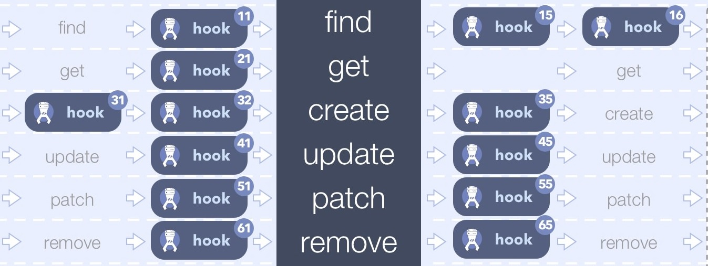
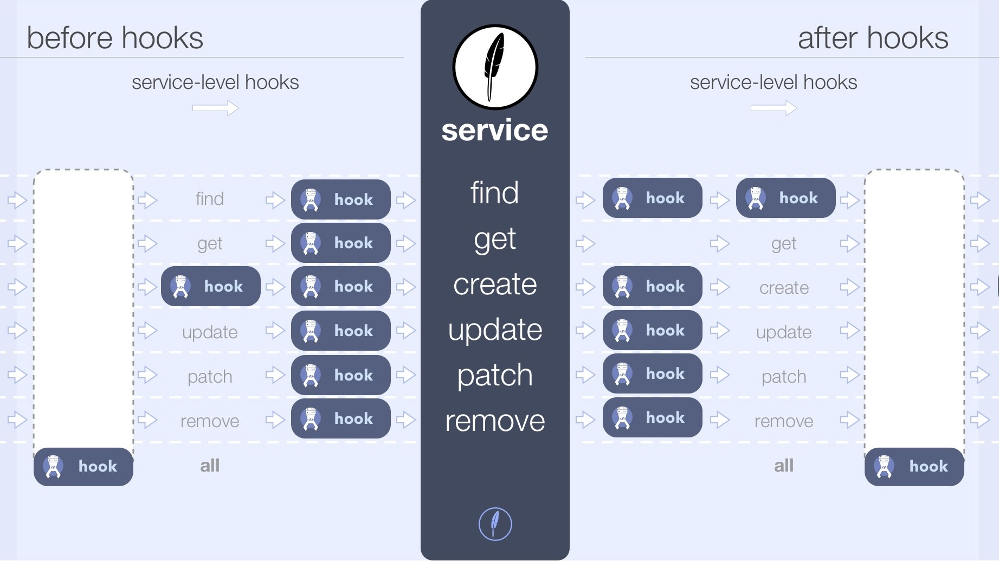
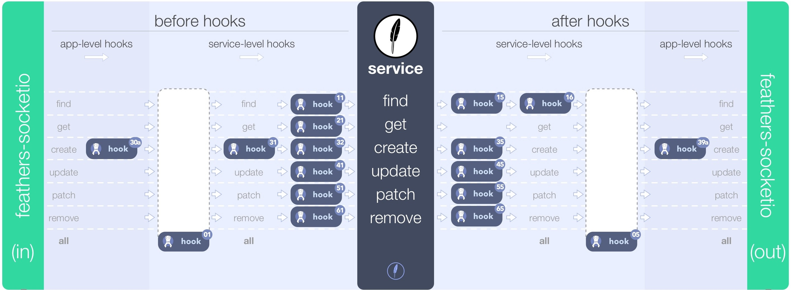
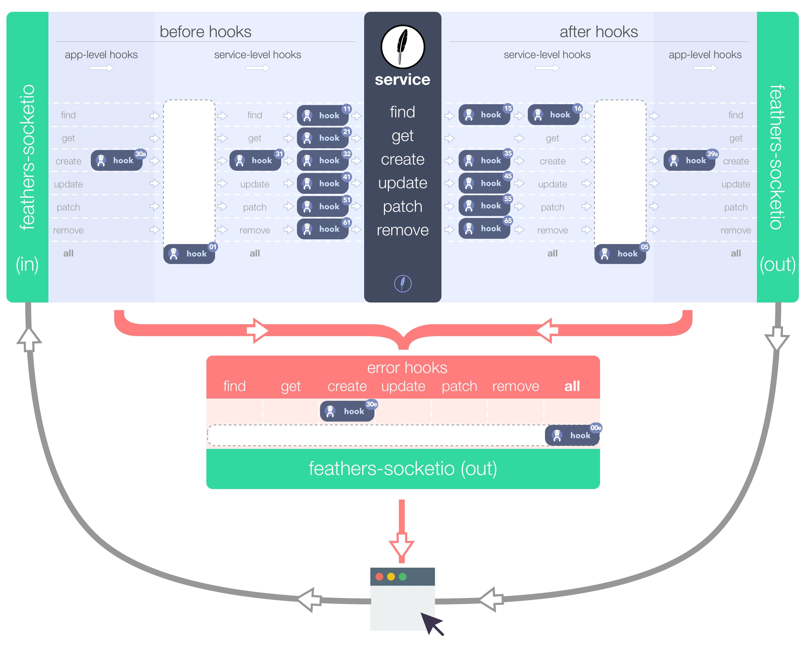

# All About Hooks

## Method hooks

Each service method may have its own hooks.
After all, you'll likely need to do something different for `create` than for a `find`.



The Feathers code would be:
```javascript
const messagesHooks = {
  before: {
    find: hook11(),
    get: hook21(),
    create: [ hook31(), hook32() ],
    update: hook41(),
    patch: hook51(),
    remove: hook61(),
  },
  after: {
    find: [ hook15(), hook16() ],
    create: hook35(),
    update: hook45(),
    patch: hook55(),
    remove: hook65(),
  }
};
const messages = app.service('messages');
messages.hooks(messagesHooks);
```

## Service hooks

Some hooks, such as authentication, may need to be run for every method.
You can specify them once rather than repeating them for every method.



Your Feathers code would *additionally* include:
```javascript
const messagesHooks = {
  before: {
    all: hook01(),
  },
  after: {
    all: hook05(),
  }
};
```

## App hooks

You may want to run some hooks for every service.
The [Feathers profiler](https://github.com/feathersjs/feathers-profiler),
for example, adds before and after hooks to time each service call.



The Feathers code for these application level hooks would be:
```javascript
app.hooks({
  before: {
    create: hook38
  },
  after: {
    create: hook39
  },
});
```

## Errors and error hooks

Errors may be thrown inside hooks - by JavaScript, by the Feathers database adapter,
or by your own code.

Your hook can, for example, return a formatted message as follows:
```javascript
// On server
const errors = require('feathers-errors');
throw new errors.BadRequest('Invalid request', {errors: {email: 'Invalid Email'} }); // inside hook

// On client
messages.create(...)
  .then(data => ...)
  .catch(err => {
    console.log(err.messages); // Invalid request
    console.log(err.errors.email); // Invalid Email
  });
```

You can optionally deal with thrown errors in the service:



Your Feathers code would *additionally* include:
```javascript
app.hooks({
  error: {
    all: hook90,
    create: hook30
  }
});
```

### Is anything wrong, unclear, missing?
[Leave a comment.](https://github.com/feathersjs/feathers-docs/issues/new?title=Comment:Step-Basic-About-Hooks-2&body=Comment:Step-Basic-About-Hooks-2)

