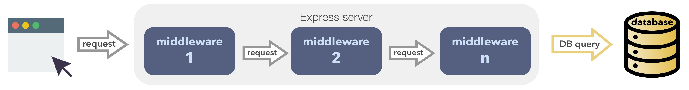

# Hooks middleware

## Linux pipes

One of the more powerful features of Linux is pipes,
which has shaped its toolbox philosophy.
A pipeline is a sequence of processes chained together,
so that the output of each process feeds directly as input to the next one.

For example, to list files in the current directory (ls),
retain only the lines of ls output containing the string "key" (grep),
and view the result in a scrolling page (less),
a user types the following into the command line of a terminal:
```text
ls -l | grep key | less
```

## Express middleware

At the heart of pipes lies a design pattern:
[Chain of Responsibility (CoR)](https://en.wikipedia.org/wiki/Chain-of-responsibility_pattern).
The CoR pattern uses a chain of objects to handle a request.
Objects in the chain forward the request along the chain.
Processing stops after an event is handled.



[Express](https://expressjs.com/)
[middleware](https://expressjs.com/en/guide/using-middleware.html)
uses the CoR pattern.
You should be familiar with the following code if you've ever used Express.
A HTTP request is handled by each of these Express functions in sequence.
```javascript
app.use(cors());
app.use(helmet());
app.use(compress());
app.use(bodyParser.json());
app.use(bodyParser.urlencoded({ extended: true }));
app.use(favicon(path.join(app.get('public'), 'favicon.ico')));
app.use('/', feathers.static(app.get('public')));
```

The CoR pattern promotes the idea of [loose coupling](https://en.wikipedia.org/wiki/Loose_coupling)
and it lets us combine simple functions to build solutions for specific needs.

## Feathers hooks

Applications are about more than the reading and writing of raw database items.
Application-specific logic often needs to run before and after service calls.

You will implement most of your business requirements with [service hooks](../../../api/hooks.md),
which are middleware functions that run for each service method.
Feathers calls the data passed between these hooks the `context` object
(in order not to confused them with the HTTP `request` object).

Hook middleware is organized like this:


and the corresponding Feathers code would be:
```javascript
const messagesHooks = {
  before: {
    create: [ hook11(), hook12() ]
  },
  after: {
    create: [ hook15(), hook16() ]
  }
};
const messages = app.service('messages');
messages.hooks(messagesHooks);
```

You can see that a series of hooks are run between the service call and the actual call to the database.
These hooks may, for example:
- Ensure the user is authenticated,
- Ensure the user is allowed to perform this operation,
- Validate the data for the service call. i.e. the data in the `context` object,
- Update the record's `updatedAt` value, thus modifying the `context` object,
- Perhaps not allow the service call to proceed, or return a specified response for it.

> **ProTip** Hooks may be synchronous or async (using promises or async/await).
The next hook will run only when the current one finishes (sync) or resolves (async),
so hooks are always run sequentially.

A series of hooks is also run after the actual call to the database, if that call was successful.
These hooks may:
- Populate the response with related information,
e.g. information about the user who created the returned record,
- Remove information for security reasons, e.g. the user password.

You can implement all your business logic related to service calls with hooks.

> **ProTip** The DB call is middleware too!
It uses the information in the `context` object to call the database,
and then updates `context` with the result.


> **ProTip** Services are usually database adapters, but they need not be.
You can create a service which writes to the server log for example.
A client could post logs using this service.
Hooks may be defined for all services, regardless of their type.


> **ProTip** Some people may call the `context` object the `hook` object.
The two terms are interchangeable.
