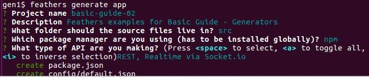
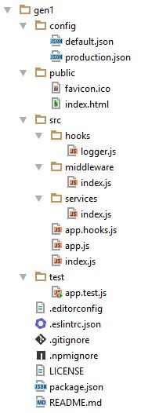

# Generating an app

Now let's write a new project using the Feathers generators.

This project will have users who may be members of one or more teams.
We want to display teams with all their members.

## Create the app

The first thing we do is generate the basic app. For that, we will first have to create and move into a new folder:

```
mkdir feathers-app
cd feathers-app
```

Then we can run:

```
feathers generate app
```



The generator creates some
[modules](https://github.com/feathersjs/feathers-docs/blob/master/examples/step/02/gen1/)
reflecting your choices.
The modules are properly wired together and structured as recommended by the Feathers team.

They are mostly [boilerplate](https://en.wikipedia.org/wiki/Boilerplate_code)
and organized as follows:



## config/
 
Contains the configuration files for the app.
[production.json](https://github.com/feathersjs/feathers-docs/blob/master/examples/step/02/gen1/config/production.json)
values override
[default.json](https://github.com/feathersjs/feathers-docs/blob/master/examples/step/02/gen1/config/default.json)
ones when in production mode,
i.e. when you run `NODE_ENV=production node path/to/your/server.js`.

## node_modules/

The generator installs the project dependencies here using either
[npm](https://docs.npmjs.com/),or [yarn](https://yarnpkg.com/en/) if that's installed.
The dependencies are itemized in `package.json`.

## public/
 
Contains the resources to be served.
A sample favicon and
[HTML file](https://github.com/feathersjs/feathers-docs/blob/master/examples/step/02/gen1/public/index.html)
are included.

## src/
 
Contains the Feathers server.
    
- **hooks/** contains your custom hooks,
usually those general enough to be used with multiple services.
A simple but useful
[logger](https://github.com/feathersjs/feathers-docs/blob/master/examples/step/02/gen1/src/hooks/logger.js)
is provided as an example.
    
- **middleware/** contains your Express middleware.
    
- **services/** will contain the services.

- [index.js](https://github.com/feathersjs/feathers-docs/blob/master/examples/step/02/gen1/src/index.js)
is used by node to start the app.
    
- [app.js](https://github.com/feathersjs/feathers-docs/blob/master/examples/step/02/gen1/src/app.js)
configures Feathers and Express.

- [app.hooks.js](https://github.com/feathersjs/feathers-docs/blob/master/examples/step/02/gen1/src/app.hooks.js)
contains hooks which have to run for **all** services.
**We have not covered this capability before.**
You can configure such hooks
[like this.](https://github.com/feathersjs/feathers-docs/blob/master/examples/step/02/gen1/src/app.js#L43)
 
## test/

Contains the tests for the app.
[app.test.js](https://github.com/feathersjs/feathers-docs/blob/master/examples/step/02/gen1/test/app.test.js)
tests that the index page appears, as well as 404 errors for HTML pages and JSON.

## [.editorconfig](https://github.com/feathersjs/feathers-docs/blob/master/examples/step/02/gen1/.editorconfig)
is compatible with the [EditorConfig project](http://editorconfig.org/)
and helps developers define and maintain consistent coding styles between different editors and IDEs.

## [.eslintrc.json](https://github.com/feathersjs/feathers-docs/blob/master/examples/step/02/gen1/.eslintrc.json)
contains defaults for liniting your code with
[ESLint](http://eslint.org/docs/user-guide/getting-started).

## [.gitignore](https://github.com/feathersjs/feathers-docs/blob/master/examples/step/02/gen1/.gitignore)
specifies
[intentionally untracked files](https://git-scm.com/docs/gitignore)
which
[git](https://git-scm.com/),
[GitHub](https://github.com/)
and other similar projects ignore.

## [.npmignore](https://github.com/feathersjs/feathers-docs/blob/master/examples/step/02/gen1/.npmignore)
specifies
[files which are not to be published](https://docs.npmjs.com/misc/developers#keeping-files-out-of-your-package)
for distribution.

## [LICENSE](https://github.com/feathersjs/feathers-docs/blob/master/examples/step/02/gen1/LICENSE)
contains the [license](https://docs.npmjs.com/files/package.json#license)
so that people know how they are permitted to use it, and any restrictions you're placing on it.

It defaults to the Feathers license.

## [package.json](https://github.com/feathersjs/feathers-docs/blob/master/examples/step/02/gen1/package.json)
contains [information](https://docs.npmjs.com/files/package.json)
which
[npm](https://docs.npmjs.com/),
[yarn](https://yarnpkg.com/en/)
and other package managers need to install and use your package.

## What's next?

The generated code will look familiar.
It contains nothing more than what we have covered previously.
The main advantage of the Feathers generators is

- Generators structure your app.
The generated modules are structured as recommended by the Feathers team.

- Generators write the repetitive boilerplate.
So you don't have to.

- Generators handle database specifics.
The generators will generate code for different databases.
So you don't have to investigate how to do so.

Next we will [add authentication to the application we just generated](./gen-authentication.md).

### Is anything wrong, unclear, missing?

[Leave a comment.](https://github.com/feathersjs/feathers-docs/issues/new?title=Comment:Step-Generators-App&body=Comment:Step-Generators-App)
