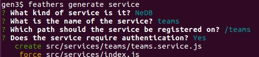

# Generating an app

Let's write a new project using the Feathers generators.

This project will have users and teams.
A user may belong to zero, one or more teams.
We will want to display teams with all their members.

## Create the app

The first thing we do is generate the basic app using:

This wrote
[app/](https://github.com/feathersjs/feathers-docs/blob/auk/examples/step/02/gen1/)

## Add authentication

We then generate some basic authentication using:

## Add the teams service

We then generate the teams service using:

## Add the populate hook

When we obtain a teams record, we want to add the team's users to the team record.
This requires a hook and therefore we generate the scaffolding for a hook using:

### Is anything wrong, unclear, missing?
[Leave a comment.](https://github.com/feathersjs/feathers-guide/issues/new?title=Comment:Step-Generators-App&body=Comment:Step-Generators-App)
