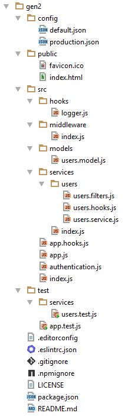

# Add authentication

We can now use the generator to add some local authentication to the app.

The generator adds some new modules to our app as well as modifying some existing ones.

## New modules

The directories have changed:

## Code changes

You can see what changes were made her:
[Unified](http://htmlpreview.github.io/?https://github.com/feathersjs/feathers-docs/blob/auk/examples/step/_diff/02-gen2-line.html)
|
[Split](http://htmlpreview.github.io/?https://github.com/feathersjs/feathers-docs/blob/auk/examples/step/_diff/02-gen2-side.html)

## 

### Is anything wrong, unclear, missing?
[Leave a comment.](https://github.com/feathersjs/feathers-guide/issues/new?title=Comment:Step-Generators-Auth&body=Comment:Step-Generators-Auth)
