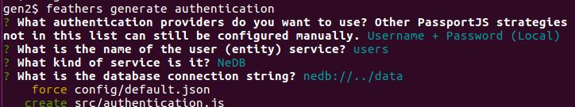
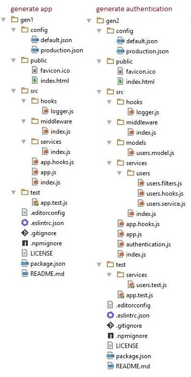

# Add authentication

We can now use the generator to add some local authentication to the app.

The generator will add some new modules and modify some existing ones.
You can see all the changes here:
[Unified](http://htmlpreview.github.io/?https://github.com/feathersjs/feathers-docs/blob/auk/examples/step/_diff/02-gen2-line.html)
|
[Split](http://htmlpreview.github.io/?https://github.com/feathersjs/feathers-docs/blob/auk/examples/step/_diff/02-gen2-side.html)

## New modules

The directories have changed:

## The users service

The generator has added a `users` service to the app
because local authentication requires we keep a database of users.

This caused the following modules to be added:

- [src/models/users.model.js](https://github.com/feathersjs/feathers-docs/blob/auk/examples/step/02/gen2/src/models/users.model.js)
describes how `users` in indexed. `NeDB` is a
[NoSQL](https://en.wikipedia.org/wiki/NoSQL) database and the index is only information it needs.

- **src/services/users** contains the rest of the `users` service.

    - [users.service.js](https://github.com/feathersjs/feathers-docs/blob/auk/examples/step/02/gen2/src/services/users/users.service.js)
    configures the service.
    
    - [users.hooks.js](https://github.com/feathersjs/feathers-docs/blob/auk/examples/step/02/gen2/src/services/users/users.hooks.js)
    configures the hooks for the service.
    The `authenticate('jwt')` hooks ensure only authenticated users can perform method calls.
    The `hashPassword()` hook encrypts the password when a new user is added.
    
    - [users.filters.js](https://github.com/feathersjs/feathers-docs/blob/auk/examples/step/02/gen2/src/services/users/users.filters.js)
    will allow you to control which clients are notified when a user is mutated.
    
- [test/services/users.test.js](https://github.com/feathersjs/feathers-docs/blob/auk/examples/step/02/gen2/test/services/users.test.js)
tests that the service gets configured.

The service has to be wired into the app, so the generator made the following changes:

- **src/config/default.json** now
([Unified](http://htmlpreview.github.io/?https://github.com/feathersjs/feathers-docs/blob/auk/examples/step/_diff/02-gen2-default-line.html)
|
[Split](http://htmlpreview.github.io/?https://github.com/feathersjs/feathers-docs/blob/auk/examples/step/_diff/02-gen2-default-side.html))
keeps the path of the NeDB tables.
 
- **src/services/index.js** now
([Unified](http://htmlpreview.github.io/?https://github.com/feathersjs/feathers-docs/blob/auk/examples/step/_diff/02-gen2-service-line.html)
|
[Split](http://htmlpreview.github.io/?https://github.com/feathersjs/feathers-docs/blob/auk/examples/step/_diff/02-gen2-service-side.html))
configures the `users` service.

## The authentication service

The generator also added an `authentication` service to the app.
Its responsible for authenticating clients against the `users` service,
generating JWT tokens and verifying them.

The `authentication` service is a **custom service**, not a database service.
It has no model, no database table, no hooks to run when one of its methods is called.

- So instead of creating a set of folders as was done for `users`,
the generator creates the only module `authentication` needs as
[src/authentication.js](https://github.com/feathersjs/feathers-docs/blob/auk/examples/step/02/gen2/src/authentication.js)

This service also has to be wired into the app, so the generator made the following change:

- **src/config/default.json** now
([Unified](http://htmlpreview.github.io/?https://github.com/feathersjs/feathers-docs/blob/auk/examples/step/_diff/02-gen2-default-line.html)
|
[Split](http://htmlpreview.github.io/?https://github.com/feathersjs/feathers-docs/blob/auk/examples/step/_diff/02-gen2-default-side.html))
retains authentication information.

- **src/app.js** now
([Unified](http://htmlpreview.github.io/?https://github.com/feathersjs/feathers-docs/blob/auk/examples/step/_diff/02-gen2-app-line.html)
|
[Split](http://htmlpreview.github.io/?https://github.com/feathersjs/feathers-docs/blob/auk/examples/step/_diff/02-gen2-app-side.html))
configures the `authentication` service.

## Other changes

The changes to our app have introduced new dependencies and they need to be defined.

- **package.json** now
([Unified](http://htmlpreview.github.io/?https://github.com/feathersjs/feathers-docs/blob/auk/examples/step/_diff/02-gen2-package-line.html)
|
[Split](http://htmlpreview.github.io/?https://github.com/feathersjs/feathers-docs/blob/auk/examples/step/_diff/02-gen2-package-side.html))
records them.

## Recap

We have not previously covered Feathers authentication,
so the authentication service written for that is brand new to us.
You can refer to the authentication
[API](https://auk.docs.feathersjs.com/api/authentication/server.html)
and guides for more details.

A `users` service was created as its needed for the local authentication.
That generated code contains no surprises for us as we have covered it before.

> **Generators.**
Feathers generators produce very little code because Feathers is so succinct.
You can easily understand the generated code because its no different from what we've been
coding "by hand" so far.

### Is anything wrong, unclear, missing?
[Leave a comment.](https://github.com/feathersjs/feathers-guide/issues/new?title=Comment:Step-Generators-Auth&body=Comment:Step-Generators-Auth)
