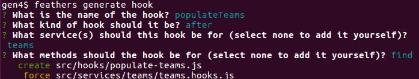
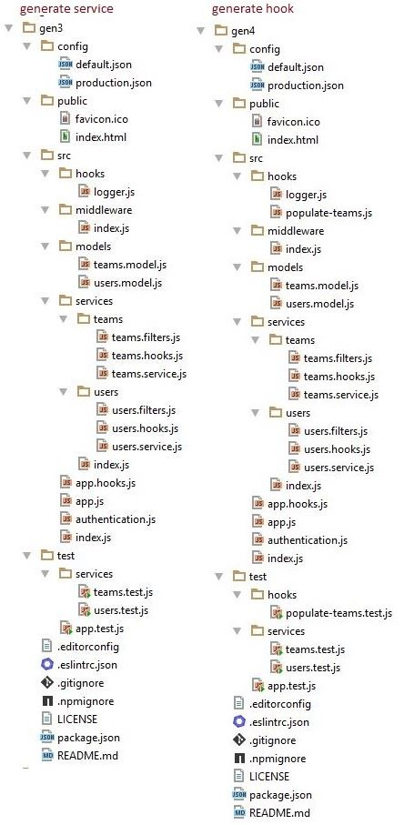

# Add the populate hook

When we obtain a teams record, we want to add the team's users to the team record.
This requires a hook and therefore we generate the scaffolding for a hook using:

```
feathers generate hook
```



The generator will add some new modules and modify some existing ones.
You can see all the changes here:
[Unified](http://htmlpreview.github.io/?https://github.com/feathersjs/feathers-docs/blob/master/examples/step/_diff/02-gen4-line.html)
|
[Split](http://htmlpreview.github.io/?https://github.com/feathersjs/feathers-docs/blob/master/examples/step/_diff/02-gen4-side.html)


## New modules

The directory has changed:




## The populateTeams hook

The generator has roughed out an after hook for the `teams` service.
This hook doesn't do anything so far, but its been placed in the structure and wired into the app.

This caused the following modules to be added:

- [src/hooks/populate-teams.js](https://github.com/feathersjs/feathers-docs/blob/master/examples/step/02/gen4/src/hooks/populate-teams.js)
contains code for a hook that presently does nothing.

- [test/hooks/populate-teams.test.js](https://github.com/feathersjs/feathers-docs/blob/master/examples/step/02/gen4/test/hooks/populate-teams.test.js)
tests that the hook is configured.

The hook had to be wired into the app, so the generator made the following changes:

- **src/services/teams/teams.hooks.js** now
([Unified](http://htmlpreview.github.io/?https://github.com/feathersjs/feathers-docs/blob/master/examples/step/_diff/02-gen4-hooks-line.html)
|
[Split](http://htmlpreview.github.io/?https://github.com/feathersjs/feathers-docs/blob/master/examples/step/_diff/02-gen4-hooks-side.html))
uses the `populateTeams`.
We told the generator to create an `after` hook for the `find` method,
and that is when it is being run.

## What's next?

The generated code, once again, contains no surprises for us as we have covered it before. Now we can [run our application](./gen-run.md).

### Is anything wrong, unclear, missing?

[Leave a comment.](https://github.com/feathersjs/feathers-guide/issues/new?title=Comment:Step-Generators-Hook&body=Comment:Step-Generators-Hook)
