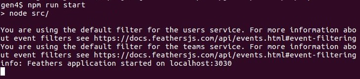

# Run the Roughed Out App


## Install dependencies

The generator will automatically install the dependencies it needs when you run it.
However they have not been included with this repo in order to save space.

So we will install them manually.

```text
cd path/to/feathers-docs/examples/step/02/gen4
npm install
```

This will install the dependencies needed by the generator example into
`/examples/step/02/gen4/node_modules`.


## Run the tests

The generator wrote
[some basic tests](https://github.com/feathersjs/feathers-docs/blob/master/examples/step/02/gen4/test/)
for what it generated.
Let's run them.


`npm run test` runs the `test` script in
[package.json](https://github.com/feathersjs/feathers-docs/blob/master/examples/step/02/gen4/package.json#L23-L28).
```text
"scripts": {
    "test": "npm run eslint && npm run mocha",
    "eslint": "eslint src/. test/. --config .eslintrc.json",
    "start": "node src/",
    "mocha": "mocha test/ --recursive"
}
```

First [ESLint](http://eslint.org/docs/user-guide/getting-started)
runs, using the options in
[.eslintrc.json](https://github.com/feathersjs/feathers-docs/blob/master/examples/step/02/gen4/.eslintrc.json).

ESLint checks the syntax and basic coding patterns of the modules in `src/` and `test/`.
Any informatory messages would be logged to the console and the processing terminated.

Next the tests themselves are run.
They were written in [Mocha](https://mochajs.org/) and use Mocha's default options.
Each test logs to the console as it runs.
The summary shows that 6 tests were successful and there were no failures.

So we can now be sure that:
- The generated code follows established best-practices for syntax and basic coding patterns.
- The generated code is wired together properly.

## Start the server

Since everything looks OK, let's start the server.



The `info` line indicates the server for our roughed out app started properly.

The `You are using the default filter for ...` lines are interesting.
They are logged from
[here](https://github.com/feathersjs/feathers-docs/blob/master/examples/step/02/gen4/src/services/users/users.filters.js#L2)
and [here](https://github.com/feathersjs/feathers-docs/blob/master/examples/step/02/gen4/src/services/teams/teams.filters.js#L2).

Feathers [real-time events](../../../api/events#service-events)
will notify all WebSocket clients of mutations occurring in Feathers DB services.
You may want to [filter](../../../api/events#event-filtering)
who gets to see which events.

These messages are logged just to remind you to do so.

## About the config files

We changed to the generated app's directory (`gen4`) to start the server.
Its nice to use `npm run start` as then we don't need to know where the server starting code resides.
However we could just as easily have run `node ./src`.

One thing the generated code assumes is that the
[`config` directory](https://github.com/feathersjs/feathers-docs/tree/master/examples/step/02/gen4/config)
is located in the current directory.
So we wouldn't be able to start the server with `node path/to/app/src`
because the config files wouldn't be found.

You can get around this by explicitly providing the direct or relative path of the configuration directory:
```text
# Linux, Mac
NODE_CONFIG_DIR=path/to/app/config node path/to/app/src
# Windows
SET NODE_CONFIG_DIR=path/to/app/config
node path/to/app/src
```

## Recap

The Feathers generators are great for roughing out a project,
creating something in its approximate, but not finished, form.

> **Generators.**
You can also use them later on to add additional services and hooks as your app evolves.

We now have the boilerplate for our app, and we start adding the custom code it requires.

### Is anything wrong, unclear, missing?
[Leave a comment.](https://github.com/feathersjs/feathers-guide/issues/new?title=Comment:Step-Generators-Run&body=Comment:Step-Generators-Run)
