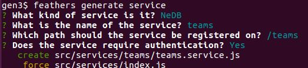
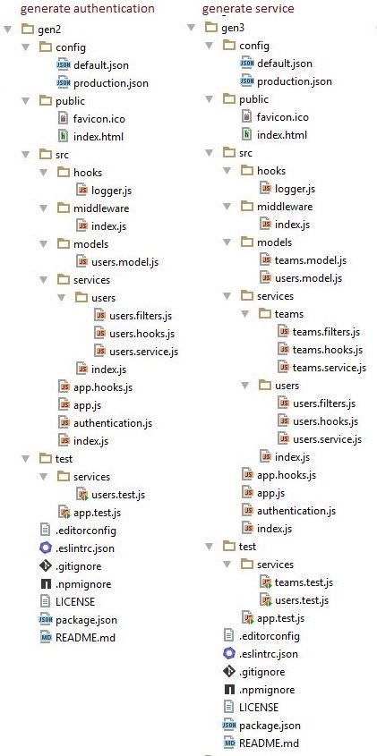

# Add the teams service

We now generate the teams service using:

The generator will add some new modules and modify some existing ones.
You can see all the changes here:
[Unified](http://htmlpreview.github.io/?https://github.com/feathersjs/feathers-docs/blob/auk/examples/step/_diff/02-gen3-line.html)
|
[Split](http://htmlpreview.github.io/?https://github.com/feathersjs/feathers-docs/blob/auk/examples/step/_diff/02-gen3-side.html)

## New modules

The directory has changed:

## The users service

### Is anything wrong, unclear, missing?
[Leave a comment.](https://github.com/feathersjs/feathers-guide/issues/new?title=Comment:Step-Generators-App&body=Comment:Step-Generators-App)
